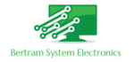

# Kapitel 1: Vorstellung des Modellunternehmens

In diesem Kapitel ...

... erfahren Sie mehr zu dem Modellunternehmen.

---

## Handlungssituation

Die Bertram System Electronics GmbH & Co. KG (kurz: BSE GmbH & Co. KG) ist ein international agierendes IT-Systemhaus mit Sitz in Hannover. Die BSE GmbH & Co. KG beschäftigt 30 Mitarbeiterinnen und Mitarbeiter in verschiedenen Abteilungen.

Die BSE bedient verschiedene Geschäftsfelder: Einerseits werden IT-Systeme jeder Größe und Komplexität angeboten, bei Bedarf eingerichtet und im Rahmen von Support-Verträgen betreut.

Andererseits bietet die BSE einen anfangs noch kleinen und mit der Zeit zunehmend größer werdenden Händler-Service an. Im Rahmen dessen wird eine Verkaufsmöglichkeit für neue und gebrauchte Hardware angeboten. In dieser nimmt die BSE eine Vermittlerrolle zwischen Verkäufer und Käufer im Sinne eines Treuhandservice ein.

