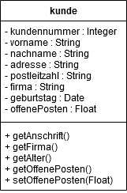
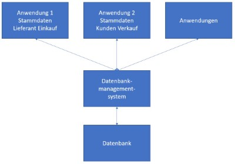

# Kapitel 2: Grundlagen der Datenhaltung in Anwendungen

In diesem Kapitel ...

- ... informieren Sie sich grob über den Aufbau objektorientierter Anwendungen.
- ... erarbeiten Sie sich die Grundlagen von Datenbanken.
- ... erfahren Sie mehr zu Vorteilen von Datenbanken ggü. einer Tabellenkalkulation.
- ... stellen Sie Grundprinzipien von Datenbanken zusammen.

---

## Handlungssituation

Matthias Thale ist langjähriger Mitarbeiter der BSE. Nachdem er im technischen Marketing jahrelang für die Auswahl von Hardwarekomponenten zuständig war, hatte er die Idee der ursprünglichen Verkaufsplattform. Nachdem Herr Thale seit 5 Jahren alleine die in einer Tabellenkalkulation organisierte Plattform verwaltete, muss er sich nun ein Jahr vor seinem Ruhestand um einen Nachfolger kümmern.

Thilo Ostiem ist der designierte Leiter des Treuhandservices. Als er sich die Verwaltung der Käufer, Verkäufer und Artikel in der Tabellenkalkulation angesehen hatte, rauchte ihm sprichwörtlich der Kopf. So würde er nicht arbeiten können, das bedeutet einen unverhältnismäßigen Arbeitsaufwand für die Einarbeitung, aber auch für die gesamte Betreuung. Das Jahr für die Übergabe möchte Herr Ostiem sinnvoll nutzen und gemeinsam mit Herrn Thale ein modernes System einrichten. Dazu muss Herr Ostiem den Kollegen Thale erstmal von seiner Idee Überzeugen: das Programmieren einer Anwendung.

Matthias Thale ist bereit, sein System in ein modernisiertes Programm zu überführen und mit seiner Erfahrung beizutragen. Dazu muss er aber wissen, wie das mit der Anwendung sowie deren Datenhaltung eigentlich funktioniert.

---

## Arbeitsauftrag A|2.0: Was ist die Objektorientierte Programmierung?

Lösen Sie die folgenden Aufgaben über das Informationsmaterial im Kurs:

1. Was ist in der Anwendungsentwicklung ein Objekt?
2. Was ist in der Anwendungsentwicklung eine Klasse?

---

## Informationsmaterial M|2.0: Überblick der Anwendungsentwicklung

### Objektorientierung

Seit Mitte der 1980er-Jahre hat die Objektorientierung und damit auch die objektorientierte Modellierung immer mehr an Bedeutung gewonnen. Ein Objekt bezeichnet die Abbildung eines Gegenstandes der realen Welt, der innerhalb der Software verwendet wird. Dabei kann es sich sowohl um programmtechnische Gegenstände, z. B. ein Fenster einer grafischen Benutzeroberfläche, als auch um Gegenstände des zu unterstützenden Problembereichs, z. B. ein Konto des Rechnungswesens, handeln.

Während die funktionsorientierte Softwareentwicklung primär auf die Algorithmen ausgerichtet ist und sich die datenorientierte Entwicklung auf die Datenelemente und ihre Beziehungen untereinander konzentriert, umfasst die Objektorientierung beide Aspekte: In einem Objekt werden die charakterisierenden Daten (Attribute) sowie die möglichen Funktionen (Methoden) eines Gegenstandes zusammengefasst. Die Inhalte der Attribute beschreiben den aktuellen Zustand des Objekts, die Methoden hingegen sein dynamisches Verhalten. Wird z. B. ein Konto als Objekt abgebildet, dann sind sowohl seine Attribute (Kontonummer, Saldo …) als auch die möglichen Funktionen (Buchen, Saldo ermitteln…) zu definieren, mit denen die Werte der Attribute manipuliert werden. Durch die gleichzeitige Betrachtung von Daten und Funktionen entfallen Zuordnungs- und Koordinationsaufgaben des Entwicklers bezüglich der Daten und den von ihnen getrennten und sie manipulierenden Funktionen.

### Klassifikation, Spezialisierung & Generalisierung

Gleichartige Objekte, die durch die gleichen Attribute und Methoden gekennzeichnet sind, werden einer gemeinsamen Klasse zugeordnet (Klassifikation). Die Konten des betrieblichen Kontenrahmens gehören alle zur Klasse Konto, denn sie werden durch die gleiche Datenstruktur und die gleichen Methoden definiert. Die einzelnen Konten, die sich nur hinsichtlich des Inhaltes ihrer Datenfelder unterscheiden, werden als Instanzen der Klasse Konto bezeichnet.

Über die Klassifikation hinaus kann die abzubildende Realität durch Spezialisierung und Generalisierung strukturiert werden:

- Die Spezialisierung bedeutet eine inhaltliche Verfeinerung einer Klasse zu mehreren davon abgeleiteten Unterklassen. Aus der Klasse Konto gehen durch Spezialisierung die Klassen Sachkonto und Finanzkonto hervor.
- Bei der Generalisierung wird in umgekehrter Richtung durch Abstraktion für mehrere Klassen eine übergeordnete Klasse gesucht.

In beiden Fällen entsteht eine Klassenhierarchie, in der übergeordnete Klassen ihre Eigenschaften, nämlich die Attribute und Methoden, an ihre untergeordneten Klassen weitergeben. Diese Weitergabe der Eigenschaften heißt Vererbung. Soll eine Software Sach- und Finanzkonten verwenden, werden diejenigen Attribute und Methoden, die für beide Klassen – Sachkonto und Finanzkonto – benötigt werden, in der übergeordneten Klasse Konto definiert. Objektinstanzen beider Klassen können bei der Ausführung der Software auf diese Definitionen zurückgreifen.

Nur die Funktionen und Datenfelder der spezialisierten Klasse definiert der Entwickler in den untergeordneten Klassen. Bei der Softwareentwicklung werden allgemein gültige Attribute und Methoden, die von Objektinstanzen aller Klassen verwendet werden, zu in der Hierarchie möglichst hoch angesiedelten Klassen zugeordnet. Dadurch greifen die Objektinstanzen beliebig vieler untergeordneter Klassen auf die Klassendefinition einer übergeordneten Klasse zurück, was den Implementierungsaufwand im Vergleich zur herkömmlichen Programmierung deutlich reduzieren kann.

*Quelle: Schwarzer, B. & Krcmar, H. (2014). Wirtschaftsinformatik. Grundlagen betrieblicher Informationssysteme (5. Aufl.) Stuttgart: Schäffer-Poeschel.*

---

## Arbeitsauftrag A|2.1: Funktionalität und Datenhaltung in Klassen und Objekten

Lösen Sie die folgenden Aufgaben über das Informationsmaterial im Kurs:

1. Wie sieht die graphische Darstellung einer einzelnen Klasse gemäß eines UML-Klassendiagramms aus? Beschreiben Sie diese in eigenen Worten.
2. Verdeutlichen Sie, wo Methoden (also die Funktionalität) einer Klasse definiert werden.
3. Verdeutlichen Sie auch, wo die Daten (im Sinne der Programmvariablen) einer Klasse definiert werden.

---

## Informationsmaterial M|2.1: UML-Klassendiagramm

Für die Analyse und das Design von Softwaresystemen ist das Klassendiagramm das wichtigste Diagramm. Hier werden Klassen und deren Beziehungen untereinander statisch dargestellt. Eine Klasse besteht aus drei wesentlichen Teilen: dem Klassennamen, den Methoden und den Attributen:

Attribute haben unterschiedliche Sichtbarkeiten. Sie können privat oder öffentlich sein. Dazu bietet das Klassendiagramm folgende Symbolik:

| Symbol | Bedeutung | Sichtbarkeit |
| :---: | :--- | :--- |
| `-` | privates Attribute (private) | Ist gegen den Zugriff von außen geschützt und kann nur über entsprechende Methoden angesprochen werden. |
| `+` | öffentliches Attribut (public) | Kann direkt angesprochen werden und wird nur selten verwendet. |
| `#` | geschütztes Attribut – spielt bei der Vererbung eine Rolle (protected) | Verhält sich nach außen wie ein privates Attribut. Innerhalb der Vererbungshierarchie aber wie ein öffentliches. Eine Klasse, die von einer anderen erbt, kann auf deren geschützte Attribute zugreifen als wäre es ihre eigenen. |

---

## Handlungssituation

Die Planung der zu programmierenden Anwendung wird über Objekte und damit abstrakter in Klassen in Form eines UML-Diagramms geplant. Die Funktionalität und die Datenhaltung werden in einer Klasse zwar vereint, aber der Fokus soll fürs Erste gemäß der Vereinbarung zwischen Matthias Thale und Thilo Ostiem auf die Daten gelegt werden.

Eine gute Datenhaltung als Basis für eine Anwendung in der Tabellenkalkulation weiterzuführen scheint wenig sinnvoll. Herr Ostiem hat bereits mehrfach Fehler festgestellt, die sich eingeschlichen haben. Eine Datenbank soll in der neuen Anwendung zur Verwaltung der Daten aufgebaut werden. Dies hat Herr Ostiem noch nie gemacht. Was ist eigentlich eine Datenbank?

---

## Arbeitsauftrag A|2.2: Was ist eine Datenbank?

Beschreiben Sie in eigenen Worten die Funktion einer Datenbank. Nennen Sie dabei auch die Vorteile, die sich durch die Nutzung von elektronischen Datenbanken ergeben.

---

## Informationsmaterial M|2.2: Aufbau einer relationalen Datenbank

Einsatzgebiete von Datenbanken
Eine Datenbank, auch bezeichnet als Datenbanksystem, ist ein System zur elektronischen Speicherung und Verwaltung von Daten. Die Hauptaufgabe einer Datenbank ist es, große Mengen an Informationen (Daten) möglichst effizient und dauerhaft bzw. sicher zu speichern. Anwender können sich gespeicherte Informationen aus einer Datenbank anzeigen lassen.

Ein Datenbanksystem besteht aus drei Komponenten:

Die Abbildung zeigt die sogenannte 3-Schichten-Technologie: Die Struktur von ERP-Systemen basiert ebenfalls auf der Grundstruktur der 3-Schichten-Technologie.

Zum einen wird eine Verwaltungssoftware (Datenbankmanagementsystem) benötigt. Diese greift zum anderen auf die zu verwaltenden Daten an sich, also die Datenbank im engeren Sinn, zu. Die Funktion der Verwaltungssoftware besteht in der Organisation bzw. strukturierten Speicherung der Daten. Sie kontrolliert z.B. die Zugriffe (Daten lesen und schreiben) auf die Datenbank.

Datenbanken werden in nahezu allen Bereichen der elektronischen Datenverarbeitung genutzt. In Unternehmen finden Datenbanken z.B. Anwendung bei der Erfassung und Auswertung von Kundendaten, Lieferanten, Artikel usw. Dabei greifen verschiedene Anwendungen über das Datenbankmanagementsystem auf die Datenbank zu. Die erfassten Daten werden in Tabellenform gespeichert.

Auch hinter vielen Websites stehen umfangreiche Datenbanken. Bei Nutzung von Social-Networks werden z.B. persönliche Angaben, Beiträge und Fotos in großen Datenbanken gespeichert und Personen bzw. Personengruppen zugeordnet.

### Vorteile von Datenbanken sind unter anderem:

- Effizienz: Daten werden nur einmalig erfasst. Die gespeicherten Informationen sind für alle Anwendungen und Einsatzgebiete im Unternehmen verfügbar, auch über Unternehmensgrenzen hinweg. Das spart Zeit und Personalkosten in Hinblick auf die Datenpflege. Datenkorrekturen müssen nur einmal erfasst werden und stehen sofort für alle zur Verfügung. Es treten weniger Fehlerquellen durch mehrfache Datenpflege auf. Alle Daten können bei Bedarf von einer großen Mitarbeiterzahl genutzt werden. Dabei regeln Steuerungen im Datenbankmanagementsystem, dass ein Datensatz nicht von mehreren Personen gleichzeitig bearbeitet werden kann. Während ein Mitarbeiter einen Datensatz bearbeitet, ist dieser für alle anderen zur Bearbeitung gesperrt.
- Verwaltung von großen Datenmengen: Daten können über einen unbegrenzten Zeitraum in einer unbegrenzten Menge gehalten (gespeichert) und wieder zur Verfügung gestellt werden. Gerade große Unternehmen speichern riesige Mengen an Daten. Sehr große Datenmengen können in Auswertungen mit einbezogen werden z.B. für Analysen und daraus folgende Prognosen.

### Verbreitete Datenbankprogramme

Es gibt eine Vielzahl von verschiedenen Datenbanken. "Global Player" sind hierbei die Datenbanken der Firmen Oracle und IBM. Als kostenlose Open-Source-Alternative ist die Datenbank MySQL zu nennen, welche wir im weiteren Verlauf dieses Kurses nutzen werden. Von der Firma Microsoft wird das Programm Access angeboten. Dieses ermöglicht einerseits graphische Darstellungen und Verwaltung von Datenbanken, als auch eine SQL-Eingabe.

--- 

## Arbeitsauftrag A|2.3: Einsatzgebiete für Datenbanken

Zählen Sie auf, in welchen Abteilungen eines Unternehmens Datenbanken sinnvolle Unterstützung bieten oder wo Sie im Alltag Datenbanken begegnen. Nennen Sie jeweils ein Beispiel und begründen Sie Ihre Wahl.

---

## Arbeitsauftrag A|2.4: Grundlagen zu Datenbanken

Beantworten Sie die folgenden Fragen:

1. Beschreiben Sie den Begriff "relationale Datenbank".
2. Erklären Sie, warum es sinnvoll ist, Tabellen miteinander zu verknüpfen.
3. Nennen Sie Vorteile einer Datenbank gegenüber einem Karteikartensystem.
4. Zählen Sie auf, welche Grundsätze Unternehmen bei der Verarbeitung von personenbezogenen Daten in Bezug auf den Datenschutz berücksichtigen müssen.

---

