# Kapitel 3: Entwurf von Datenbanken & Normalisierung

In diesem Kapitel ...

- ... analysieren Sie als Datenbank zu realisierende Zustände von Systemen.
- ... erfahren Sie mehr zur Modellierungstechnik ERM.
- ... beurteilen Sie vorliegende Tabellen.
- ... identifizieren Sie Probleme mit der Datenhaltung bestimmter Tabellen.
- ... führen Sie die Schritte der Normalisierung durch.

---

## Handlungssituation

Nachdem Matthias Thale nun mehr über Datenbanken weiß, möchte er diese erst einmal konzeptionell entwerfen, bevor er mit der Realisierung beginnt. Thilo Ostiem hat ihm dafür Material zusammen gesucht, anhand dessen die Modellierungstechnik erläutert werden soll. Die Methode der Modellierung, die sich durchgesetzt hat, ist das sogenannte Entity-Relationship-Modell (ERM). Damit Thilo Ostiem beginnen kann, müssen die einzelnen Elemente der Notation genauer betrachtet werden.

---

## Arbeitsauftrag A|3.0: Beschreiben eines ER-Diagrammes

Ein Restaurant möchte eine bestehende Datenbank erweitern. Bisher sind einige Sachverhalte für die Vorratshaltung abgebildet:

- Ein Rezept hat mehrere Zutaten.
- Eine Zutat kann in mehreren Rezepten verwendet werden.
- Eine Zutat stammt immer genau aus einem Lagerort.
- Lagerorte werden für mehrere Zutaten genutzt.

So kann in dem Restaurant bisher folgendes dargestellt werden:

- Für den hauseigenen Vollkorn-Pizzateig werden Weizenmehl, Vollkornmehl, frische Hefe, Salz, Zucker, Olivenöl und Wasser benötigt.
- Vollkornmehl, Weizenmehl, Salz und Zucker werden im Trockenlager bevorratet.
- Frische Hefe muss in den Kühlschrank.
- Olivenöl ist im Flaschenlager zu finden.
- Eine Zutat hat eine Maßeinheit, bspw. wird Weizenmehl in Gramm (g) angegeben.
- Rezepte haben einen Namen, der auf der Karte ausgewiesen wird.
- ...

Beschreiben Sie mit eigenen Worten den Aufbau eines ER-Diagramms immer in Bezug auf das Beispiel:

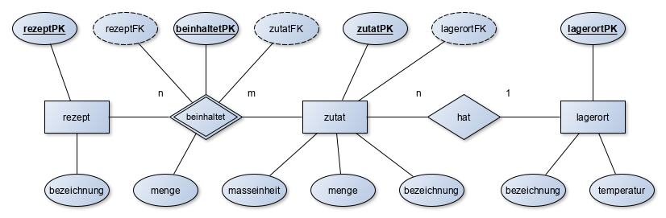

 
1. Was sind Entitäten?
2. Was sind Attribute?
3. Was sind Beziehungen?
4. Was sind Kardinalitäten?
5. Was bedeuten die im Beispiel eingesetzten Kardinalitäten in dem Fall?
6. Welche Aufgabe hat der Primärschlüssel?
7. Welche Aufgabe hat der Fremdschlüssel?
8. Was ist referenzielle Integrität?

---

## Arbeitsauftrag A|3.1: Beziehungstypen

Greifen wir noch einmal das folgende Beispiel auf:

 
Erläutern Sie, was genau die n:m-Beziehung darstellt.
Warum wird bei der n:m-Beziehung die Beziehungsentität benötigt?
Auf welcher Seite steht in einer 1:n-Beziehung der Fremdschlüssel?

---

## Informationsmaterial M|3.0: Grundlagen des Entity-Relationship-Modells (ERM)

### Grundlagen & Software

Das Entity-Relationship-Modell, kurz ERM, ist ein einfaches Modell für den Entwurf von Datenbanken. Die deutsche Übersetzung des Begriffes lautet in etwa: Gegenstand-Beziehung-Modell. Das ERM besteht aus einer Abbildung, dem ER-Diagramm (kurz auch ERD genannt). Die darin verwendeten Elemente enthalten eine Beschreibung.

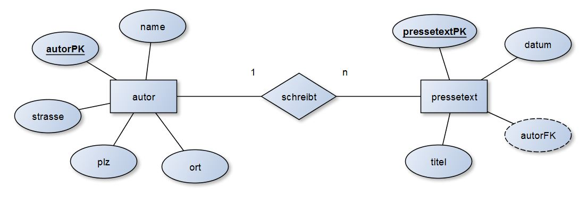

Ein erster Entwurf kann entweder handschriftlich oder mit einem Computerprogramm erfolgen. Einige Softwarevorschläge sind bspw.:

- [yEd - Graph Editor - yWorks](https://www.yworks.com/downloads#yEd) (für Einsteiger & Fortgeschrittene; erfüllt die im Unterricht verwendete Notation voll)
- [MySQL Workbench](https://www.mysql.com/de/products/workbench/) (tendenziell eher für Fortgeschrittene; erfüllt die im Unterricht verwendete Notation teilweise)

!!! note "Hinweis"
    Sie müssen hinsichtlich der IHK-Prüfungen und Klausuren unbedingt in der Lage sein, ER-Diagramme auch auf Papier zu zeichnen. Das mag zwar etwas komisch klingen, aber der Schwierigkeitsgrad ist aufgrund mangelnder Verschiebemöglichkeiten bedeutend höher und sollte zwingend ebenfalls geübt werden.

Bei dem Aufbau eines ER-Modells bzw. des daraus resultierenden ER-Diagrammes sind unterschiedliche Darstellungsformen in Gebrauch. Die bekannteste Form stellt die sogenannte Chen-Notation von Peter Chen dar. Chen gilt als Entwickler der ER-Diagramme. Die grundlegenden Elemente werden im Folgenden erklärt.

### Entität (Entity)

Als Entität wird ein eindeutig bestimmbares Objekt bezeichnet. Über dieses Objekt sollen Informationen (z.B. Attribute) gespeichert oder verarbeitet werden.

Eine Entität wird im ER-Diagramm als Rechteck dargestellt und grundsätzlich im Singular beschrieben.

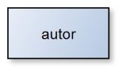

Beispiele: Artikel, Lieferer, Kunde, Person, Autor, Dokument usw.

### Attribut

Ein Attribut ist ein Merkmal bzw. Kennzeichen eines Objektes, also einer Entität. Jede Entität kann beliebig viele Attribute besitzen. Das Wort Attribut lässt sich auch als Eigenschaft bezeichnen.

Ein Attribut wird im ER-Diagramm als Ellipse dargestellt. Die Attribute werden mit ungerichteten Kanten zu den Entitäten verbunden.

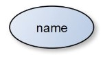

Beispiele: Artikelnummer, Name, Ort, Datum, Menge usw.

Während z.B. das Attribut "Ort" eine Eigenschaft einer Entität darstellt, sind "Hannover" oder "Oldenburg" konkrete Attributwerte. In ER-Diagrammen werden stets nur Attribute und nicht Attributwerte benutzt.

### Beziehung (Relationship)

Als Relationship oder Relation bezeichnet man die Beziehung zwischen zwei Objekten (Entitäten). Durch die Nutzung von Relationships sollen im Datenbankentwurf Sachverhalte zwischen zwei Objekten dargestellt werden.

Eine Beziehung wird im ER-Diagramm als Raute dargestellt. Diese verbindet mit Linien zwei Entitäten.

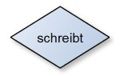

In den vorherigen Beispiel werden die Entitäten "Autor" und "Pressetext" durch die Entität "schreibt" in Beziehung gesetzt: "Autor schreibt einen Pressetext" oder anders herum "Ein Pressetext hat einen Autor". Hieraus wird auch der kleinste Standard deutlich, denn das Wort "hat" passt i.d.R. in die Beziehung. Es sollte aber ein möglichst treffendes Verb benutzt werden.

Weitere Beispiele sind: Lieferer liefert Artikel, Kunde bestellt Artikel, Schüler besucht Klasse.

Einfache Diagramme können bereits nur mit Entitäten, Attributen und Relationships entworfen werden. Für eine genauere Planung fehlen aber noch ein paar Elemente.

### Primärschlüssel (Primary Key)

Ein Primärschlüssel wird verwendet, um einen Datensatz eindeutig zu identifizieren. Ein Schlüsselfeld bedient sich dabei eines Attributs.

Ein Schlüsselfeld wird durch ein Attribut (Ellipse) dargestellt. Der Text ist dabei im Gegensatz zu weiteren Attributen unterstrichen.

Beispiele: Autoren Nr., Pressetext Nr, Kundennummer, Personalnummer

### Kardinalitäten (Cardinalities)

Kardinalitäten stellen Mengenangaben dar. Durch Kardinalitäten wird beschrieben, in welchem "Mengenverhältnis" zwei Entitäten in Beziehung zueinander stehen können. Dazu werden mathematische Mengenangaben genutzt (z.B. 1 oder n = beliebig viele).

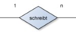

Beispiel (1:n): Ein Autor (1) schreibt (n) beliebig viele Pressetexte.

Beispiel (1:1): Ein Ehemann (1) hat (1) genau eine Ehefrau und umgekehrt.

---

## Informationsmaterial M|3.1: Schlüsselattribute

### Primärschlüssel

Wie bereits im vorherigen Informationsmaterial beschrieben ist, nehmen Primärschlüssel(-felder) in Datenbanken eine sehr wichtige Funktion ein. Alle Tabellen benötigen einen sogenannten Primärschlüssel.

Jeder einzelne Datensatz wird dabei durch einen Primärschlüssel beschrieben. Durch die Vergabe von Primärschlüsseln können z.B. Verwechslungen ausgeschlossen werden. Zum Beispiel existieren in Deutschland mehrere Personen mit dem gleichen Namen und Geburtsdatum (z.B. Tim Jansen, geboren am 19.12.1980). Durch die Vergabe von Primärschlüsseln, z.B. einer Personal- oder Sozialversicherungsnummer, können die einzelnen Datensätze ohne Verwechslung unterschieden werden. Ein Primärschlüssel kann dabei aus Ziffern, Buchstaben oder Kombinationen (alphanumerisch) gebildet werden. Entscheidend ist, dass ein Primärschlüssel einzigartig ist, z.B. durch Vergabe einer durchlaufenden Nummer, und er sich niemals ändert. Ein Kunde eines Unternehmens erhält z.B. für die Dauer der Geschäftsbeziehungen eine einzigartige Kundennummer. Mithilfe von Primärschlüsseln können auch Beziehungen zwischen Tabellen in einer Datenbank hergestellt werden.

Erst durch einen Primärschlüssel ist eine Beziehung (Relation) zwischen zwei Tabellen möglich.

Beispiel: Nachfolgend wird eine Pressetext-Nr. als Primärschlüssel verwendet. In diesem Fall setzt sich die Nummer aus Teilen des Datums und einer fortlaufenden Nummer zusammen:

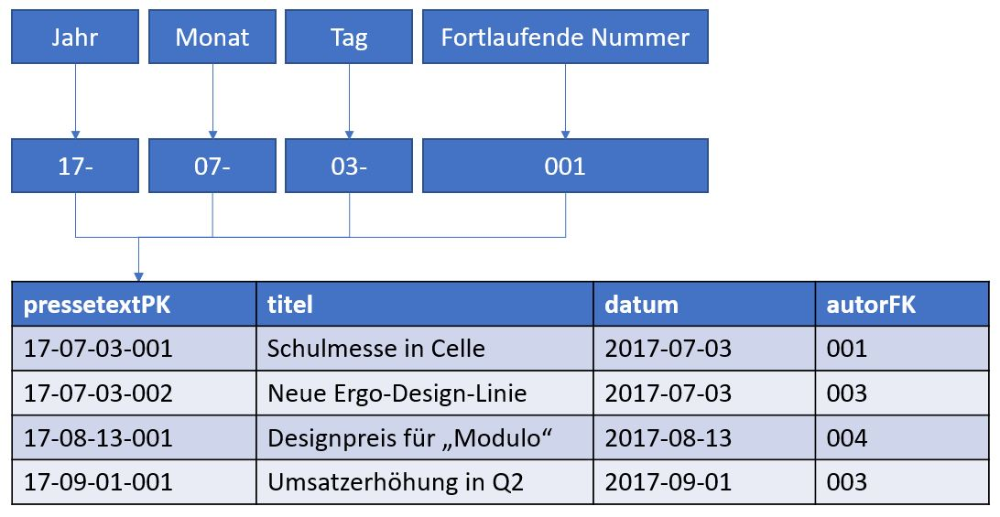

Primärschlüssel können, wie in dem vorhergehenden Beispiel, entweder selbst generiert werden, oder man greift auf bereits "bestehende" Primärschlüssel zurück. Eine Buchhandlung kann sich z.B. der ISBN-Nummer bedienen. Bei einem Supermarkt bietet sich die EAN (die Nummer, die der Barcode darstellt) für die geführten Artikel an.

Die folgenden Schlüsselarten lassen sich bei einem Datenbankentwurf unterschieden.

#### Natürlicher Primärschlüssel

Als natürlichen Primärschlüssel können alle Schlüssel verstanden werden, die bereits durch ein Objekt (Entität) gegeben sind.

Ein Buchgeschäft kann z.B. die ISBN eines Werkes einfach in die eigene Datenbank übernehmen oder ein Vermieter von E-Bikes übernimmt die Seriennummer der Fahrzeuge.

#### Künstlicher Primärschlüssel

Künstliche Primärschlüssel werden oft vergeben, wenn kein natürlicher Schlüssel vorliegt oder übernommen werden soll. Künstliche Primärschlüssel werden bei dem Anlegen der Datenbank festgelegt.

Beispiele: Ein Unternehmen vergibt Kundennummern, um seine Kunden eindeutig voneinander zu unterscheiden.

#### Zusammengesetzter Primärschlüssel

Ein zusammengesetzter Primärschlüssel ist ein Schlüssel, der durch die Kombination von verschiednenen Attributen erzeugt wird. In der Praxis kann ein zusammengesetzter Primärschlüssel zu Problemen führen. Bei einer Rechnung könnte der Primärschlüssel z.B. aus dem Datum und der Kundennummer erzeugt werden. Falls ein Kunde zwei Rechnungen an einem tag ausgestellt bekommen würde, wäre ein Schlüssel doppelt vergeben. Ein "reiner" zusammengesetzter Primärschlüssel ist daher selten anzutreffen. Entweder wird dieser um einen künstlichen Primärschlüssel ergänzt (z.B. eine fortlaufende Nummer) oder ersetzt.

### Fremdschlüssel
Ein Fremdschlüssel wird benötigt, um zwei Tabellen bzw. zwei Objekte miteinander zu verknüpfen. Was in der einen Tabelle ein Fremdschlüssel ist, ist in der anderen Tabelle ein Primärschlüssel. In einem ER-Diagramm wird der Fremdschlüssel gestrichelt umrandet (andere Notationen unterstreichen den Fremdschlüssel gestrichelt).

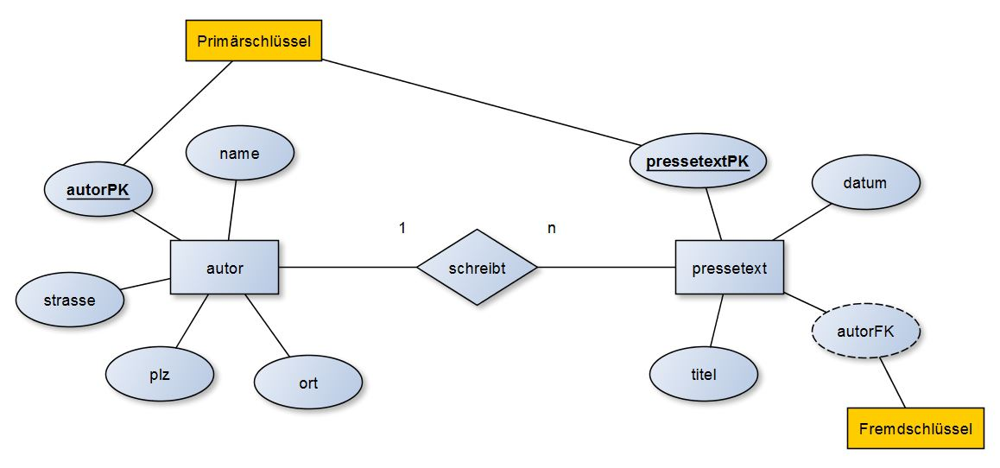

Das abgebildete ERM kann als folgende Tabellen verstanden werden:

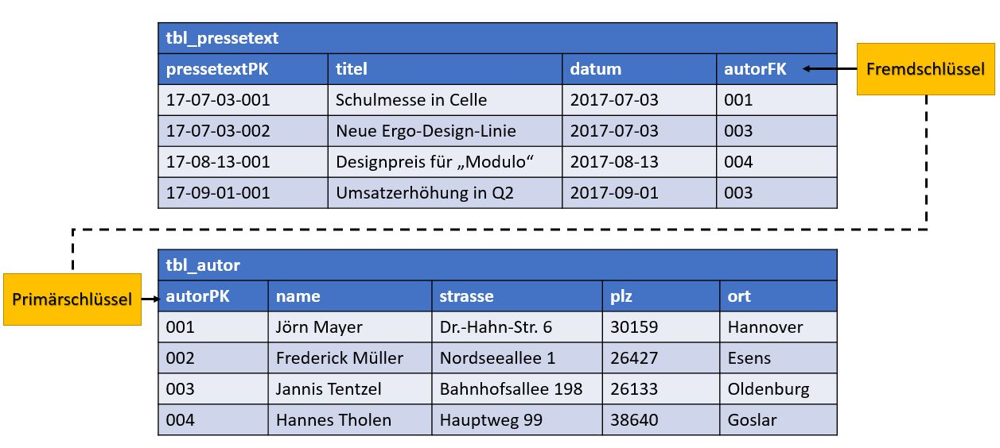

---

## Informationsmaterial M|3.2: Grundlagen der Beziehungstypen / Kardinalitäten

Die Beziehung von Objekten (Entitäten) untereinander wird durch Kardinalitäten dargestellt. In einem ER-Diagramm kann somit dargestellt werden, wie viele Objekte mit einem anderen Objekt in Beziehung stehen können. Die Bestimmung und Festlegung von Beziehungstypen stellt eine wichtige Grundlage des Datenbankentwurfes dar.

### 1-zu-1-Beziehung (1:1)

Bei einer 1-zu-1-Beziehung steht jede Entität des einen Entitätstyps mit einer Entität des anderen Entitätstyps in Beziehung und andersherum. 1-zu-1-Beziehungen sind relativ selten, da schnell Ausnahmen entstehen können.

Beispiel: Eine Frau ist mit genau einem Mann verheiratet. Die Darstellung in einem ER-Diagramm ist wie folgt:

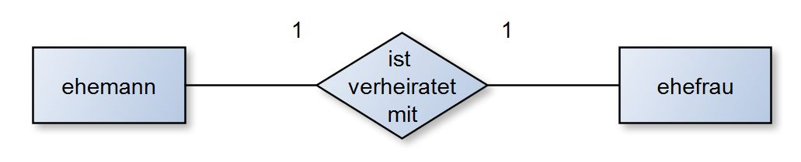

Ein weiteres Beispiel: Ein Schiff hat genau ein Schiffskennzeichen.

Die Zuordnung des Fremdschlüssels in der 1:1-Beziehung ist in beiden Tabellen möglich. Manchmal erscheint eine Tabelle logischer, als die andere; dies ist fallabhängig.

### 1-zu-n-Beziehung (1:n)

Die 1-zu-n-Beziehung ist die häufigste Kardinalität. Eine einzelne Entität des einen Entitätstyps steht dabei mit mehreren Entitäten eines anderen Entitätstyps in Beziehung. Sofern keine 1-zu-1-Beziehung vorhanden ist, wird bei einem Datenbankentwurf angestrebt, eine 1-zu-n-Beziehung herzustellen.

Beispiel: In der Tabelle aus den vorherigen Beispielen hat ein Pressetext z.B. immer genau einen Autor. Ein Autor kann aber mehrere Pressetexte verfassen. Die Darstellung in einem ER-Diagramm ist wie folgt:

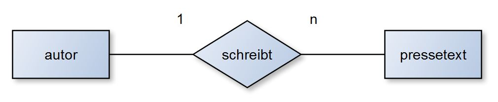

Ein weiteres Beispiel: Eine Abteilung besteht aus mehreren Mitarbeitern. Jeder Mitarbeiter ist genau einer Abteilung zugeordnet.

Der Fremdschlüssel wird bei der 1:n-Beziehung immer auf der n-Seite hinzugefügt.

### n-zu-m-Beziehung (n:m)

Jede Entität eines Entitätstyps steht mit beliebig vielen Entitäten des anderen Entitätstyps in Beziehung. Ebenso verhält es sich umgekehrt. Ein naheliegendes Beispiel sind Mitarbeiter und Projekte. Während ein Mitarbeiter an mehreren Projekten arbeiten kann, sind in einem Projekt auch mehrere Mitarbeiter beschäftigt. Dieses Beispiel würde wie folgt in einem ER-Diagramm dargestellt werden:

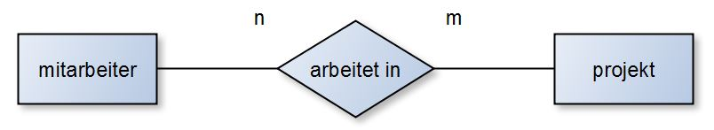

In der Praxis sind n-zu-m-Beziehungen in Datenbanken schwierig zu handhaben, genau genommen müsste die Darstellung mit einer Beziehungsentität gewählt werden. Diese wird als Doppel-Raute dargestellt. In manchen ER-Diagrammen findet man auch Darstellungen mit einer Raute in einem Rechteck (also der Mischung der Symbole von Entität und Beziehung). Das Beispiel sähe dann als Beziehungsentität wie folgt aus:

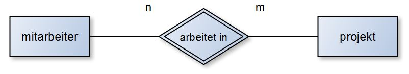

Werden im Beispiel die Primär- und Fremdschlüssel ergänzt erhalten wir folgende Darstellung:

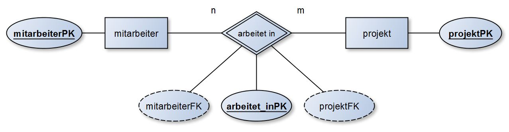

Eine Umsetzung in den Datenbanksprachen ist entgegen der ER-Diagramme nicht möglich. Dies liegt daran, dass Werte immer atomar abgespeichert werden müssen. Also könnten in einer Zelle in der Tabelle nicht mehrere Angaben gemacht werden. Es könnten z.B. Redundanzen und Inkonsistenzen auftreten. Man bedient sich daher eines Tricks: einer zusätzlichen Tabelle. Im Beispiel wird aus der Beziehung arbeitet in die Tabelle / Beziehungsentität arbeitet_in geschaffen. Hierbei stehen Mitarbeiter und arbeitet_in im Verhältnis 1:n. andererseits stehen arbeitet_in und Projekt ebenfalls im Verhältnis 1:n.

Bei einer Beziehungsentität wird ein neuer Primärschlüssel mit dem Namen der vorherigen Beziehung gebildet. Diesem werden jeweils die Fremdschlüssel beider angeschlossener Tabellen zugeordnet.

---

## Handlungssituation

Der Aufbau eines ERM ist nun bekannt, folgend soll ein näherer Blick auf die Beziehungstypen geworfen werden. Außerdem ist ein erstes ER-Diagramm zu erstellen.

---

### Arbeitsauftrag A|3.2: ERM - Beziehungstypen

Interaktives Element im Moodle-Kurs

---

### Arbeitsauftrag A|3.3: Das erste ER-Diagramm

Im Rahmen Ihrer Tätigkeit in der Bertram System Electronics GmbH & Co. KG erstellen Sie Datenbanken für verschiedene Kunden. Einer der Großkunden ist der Hannover Airport mit vielen verschiedenen Subunternehmen und Airlines. Die AirHannover hat Ihnen folgende Fakten übermittelt und bittet Sie, hierzu das entsprechende ERM zu erstellen:

- Das Personal der Fluggesellschaft AirHannover hat einen Nachnamen und einen Vornamen.
- Jedes Personalmitglied bekleidet genau einen Dienstrang, der sich durch eine Bezeichnung und eine Gehaltsklasse auszeichnet.
- Ein Dienstrang kann von mehreren Personalmitgliedern bekleidet werden.
- Jedes Personalmitglied begleitet mehrere Reisen, die durch einen ReisePK und ein Datum beschrieben werden.
- Eine Reise wird von mehreren Personalmitgliedern begleitet.

**Aufgaben:**

1. Erstellen Sie das ERM.
2. Ergänzen Sie falls nötig Schlüsselattribute.
3. Erstellen Sie das Datenbankschema in Kurzschreibweise.

---

## Informationsmaterial M|3.3: Kurzschreibweise

Die Kurzschreibweise zu einer Datenbank ist der zweite Modellierungsschritt. Da in den ER-Diagrammen in der Regel nur die Schlüsselattribute (PK & FK) eingetragen werden, sollen in der Kurzschreibweise auch die normalen Attribute betrachtet werden.

Die Kurzschreibweise zum oben genannten Beispiel sähe wie folgt aus*:

tbl_rezept(<u>rezeptPK</u>, bezeichnung)  
tbl_beinhaltet(<u>beinhaltetPK</u>, *rezeptFK*, *zutatFK*, menge)  
tbl_zutat(<u>zutatPK</u>, *lagerortFK*, masseinheit, menge, bezeichnung)  
tbl_lagerort(<u>lagerortPK</u>, bezeichnung, temperatur)

(*) der FK wird, wenn die Kurzschreibweise per Hand geschrieben wird, gestrichelt unterstrichen.

---

## Informationsmaterial M|3.4: ERM-Konventionen

### Entität

- Darstellungsform: Rechteck
- im Singular
- klein geschrieben
- keine Umlaute/Sonderzeichen/Leerzeichen

### Attribut

- Darstellungsform: Ellipse
- im Singular
- klein geschrieben
- keine Umlaute/Sonderzeichen/Leerzeichen

### Primärschlüsselattribute

- Darstellungsform: Ellipse, Attributname unterstrichen
- Attributname lautet wie die Entität mit angehängtem "PK"
- im Singular
- klein geschrieben
- keine Umlaute/Sonderzeichen/Leerzeichen

### Fremdschlüsselattribute

- Darstellungsform: gestrichelte Ellipse oder Ellipse mit gestrichelt unterstrichenem Attributnamen
- Attributname lautet wie die Entität, auf die sich der Name bezieht mit angehängtem "FK"
- im Singular
- klein geschrieben
- keine Umlaute/Sonderzeichen/Leerzeichen

### Beziehungen

- Darstellungsform: Raute
- Kardinalitäten gerne in die Nähe der Raute schreiben
- Kanten der Beziehungen immer parallel zum Seitenrand, nicht quer/diagonal zeichnen
- möglichst treffend benennen, aber "hat" funktioniert immer
- im Singular
- klein geschrieben
- keine Umlaute/Sonderzeichen/Leerzeichen
- bei mehreren Worten ggf. mit Unterstrichen "_" teilen (z.B. `gehoert_zu`)

## Beziehungsentitäten

- Darstellungsform: Doppelte Raute oder Rechteck, das eine Raute umzeichnet
- möglichst treffend benennen, hier "hat" vermeiden
- im Singular
- klein geschrieben
- keine Umlaute/Sonderzeichen/Leerzeichen
- bei mehreren Worten ggf. mit Unterstrichen "_" teilen (z.B. `gehoert_zu`)

---

