# Kapitel 5: Realisierung einer Datenbank mit MySQL


In diesem Kapitel ...

- ... installieren Sie einen MySQL-Server.
- ... analysieren Sie MySQL-Datentypen.
- ... erstellen Sie eine MySQL-Datenbank.

---

## Handlungssituation

Matthias Thale hat ein fertiges ER-Diagramm für die Datenbank vorliegen und möchte diese nun in MySQL realisieren. Dazu hat er sich Tipps von Thilo Ostiem geholt: Installation des MySQL-Servers, Erstellung eines relationalen Datenbank-Schemas sowie die damit verbundene Auseinandersetzung mit den MySQL-Datentypen stehen nun auf dem Zettel.

!!! tip "Hinweis zum MySQL-Server"
    
    Um die Aufgaben der folgenden Kapitel zu bearbeiten benötigen Sie nicht zwingend einen lokalen MySQL-Server. Sie können auch die in den kommenden Kapiteln verlinkte Datenbank als webbasierte Version nutzen. Dennoch ist es sinnvoll, sich einmal mit der Installation eines Datenbanksystems auseinanderzusetzen.

## Kompetenz 5.0: Lokale Datenbankserver installieren

Im ersten Schritt soll der MySQL-Server installiert werden. Hierzu bestehen verschiedene Optionen. Neben der Installation von MySQL auf einem Linux-System besteht auch die Möglichkeit, via XAMPP auf verschiedenen Plattformen einen Server einzurichten.

### Arbeitsauftrag A|5.0: Installation des MySQL-Servers auf dem Notebook mit XAMPP

Führen Sie die Installation für den MySQL-Server auf Ihrem Endgerät durch. XAMPP bietet hierfür eine einfache Option, einen Datenbank- und bei Wunsch auch einen Web-Server zu installieren:

[https://www.apachefriends.org/de/index.html](https://www.apachefriends.org/de/index.html)

---

### Arbeitsauftrag A|5.1: Test des MySQL-Servers

Legen Sie eine erste Testdatenbank an:

1. Starten Sie XAMPP und hierin den Apache- sowie den MySQL-Dienst.
    1. Hinweis: sollte der Dienst Apache sich nicht starten lassen, kann folgendes helfen:
       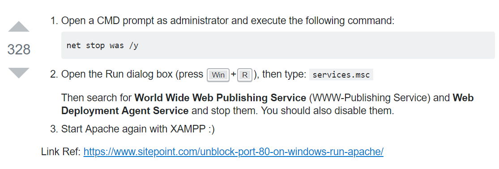
    2. Oder dieser Link für die Portbelegungen: [http://www.breitenfellner.info/klassenbereich/downloak/Portbelegung.pdf](http://www.breitenfellner.info/klassenbereich/downloak/Portbelegung.pdf)
2. Öffnen Sie phpmyadmin (z.B. über die Adresse localhost/phpmyadmin). Die folgende Übersicht erscheint.
    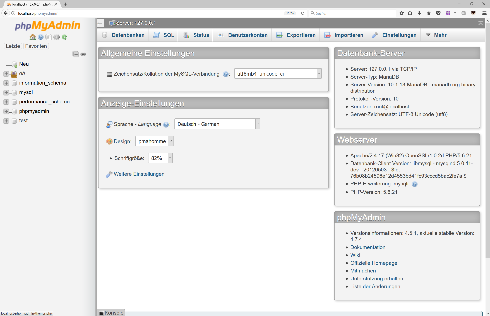
3. Wählen Sie in der linken Spalte "Neu" aus und geben Sie im Feld "Datenbankname" den Titel db_test ein. Anschließend wählen Sie "Anlegen".
    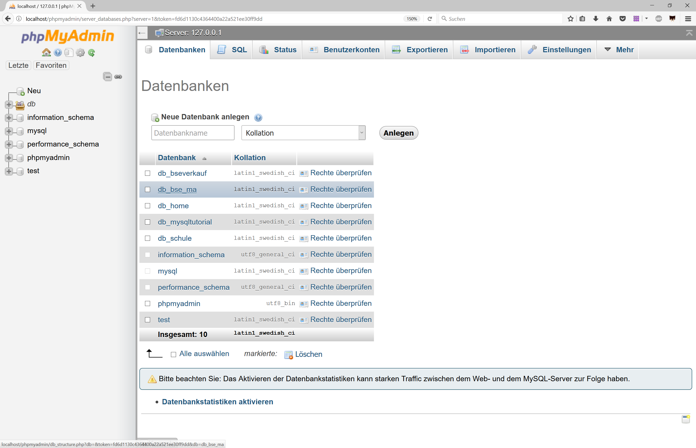
4. Der Dialog zum Erzeugen einer Tabelle wird automatisch geöffnet. Hierin geben Sie den ersten Tabellennamen "tbl_kunde" mit vier Spalten ein und bestätigen mit "OK".
    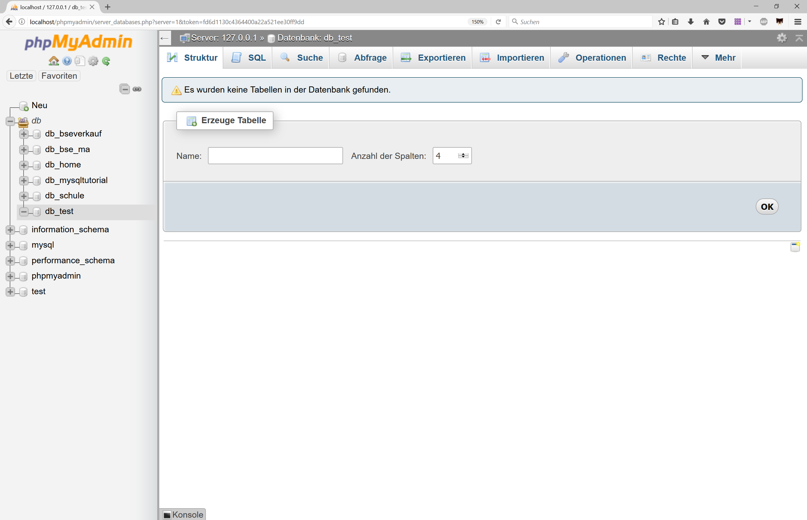
5. Danach wird die Tabellenstruktur festgelegt. Geben Sie die im Bild erkenntlichen Daten ein (Achtung, beim Primary Key ist ein Haken im Feld "A_I"). Was genau Typ, Länge/Werte usw. bedeutet, folgt später in diesem Kapitel. Schließlich wählen Sie "Speichern".
    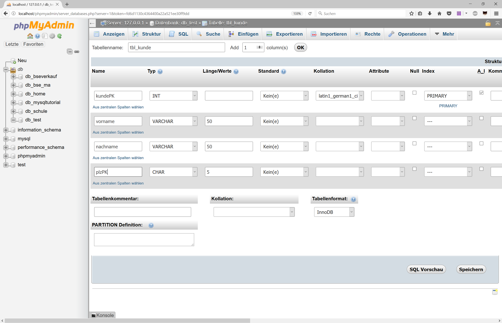
6. Nun ist die Struktur der Tabelle angelegt und wird als Übersicht in dem Reiter "Struktur" angezeigt.
    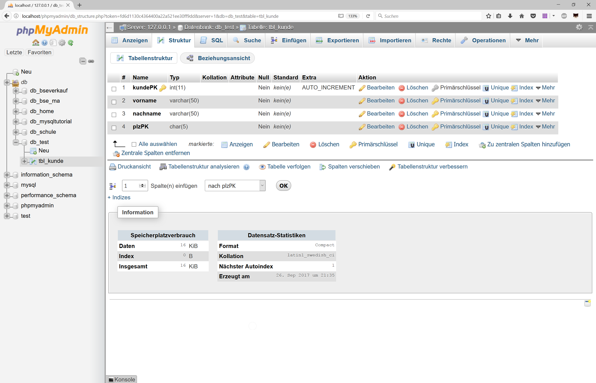
7. Anschließend wird die zweite Tabelle "tbl_plz" angelegt. Dazu wieder in der rechten Spalte direkt unter dem Eintrag "db_test" auf "Neu" gehen und die Tabelle mit 2 Spalten anlegen.
    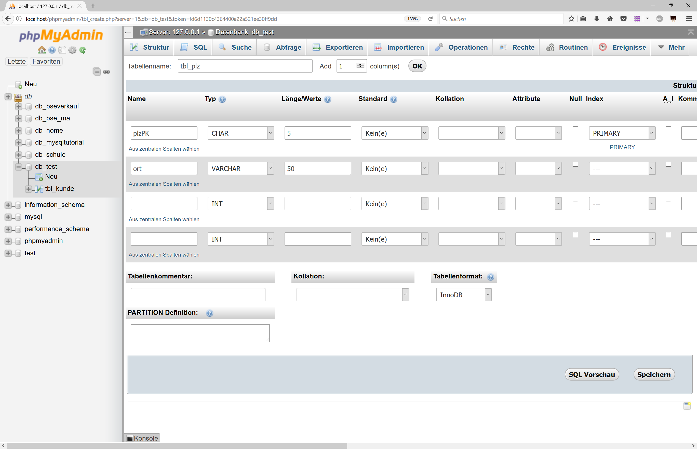
8. Über den Reiter "Einfügen" können Sie jetzt Daten in die Tabelle eintragen. Fügen Sie die Datensätze aus dem Bild hinzu uns wählen Sie dann unten "OK".
    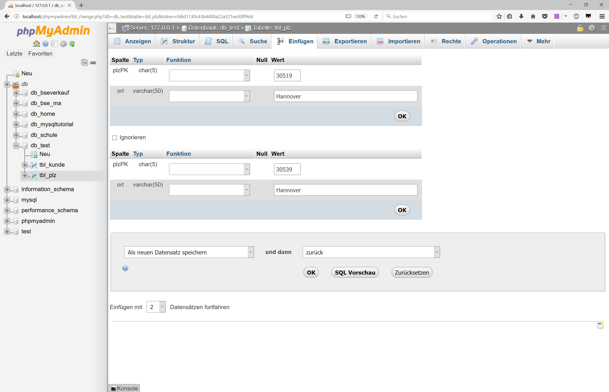
9. Die Postleitzahlen sind gepflegt, jetzt kann die Tabelle "tbl_kunde" nach gleichem Prinzip mit den folgenden Daten gefüllt werden.
    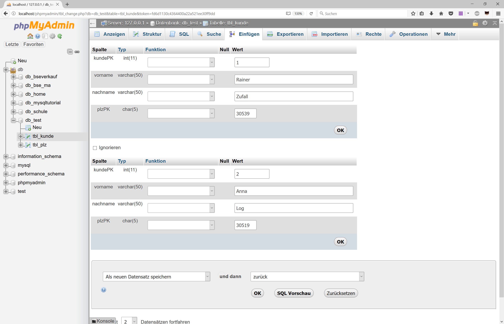
10. Der vorletzte Schritt ist die Kontrolle der Daten. Dazu wählen Sie die Tabelle "tbl_plz" in der linken Spalte aus. Danach wird im Reiter "Ansicht" ein Auszug der Daten dargestellt.
    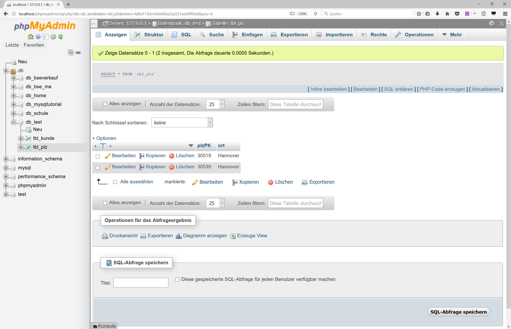
11. Zuletzt überprüfen Sie die Eingabe der Kundendaten in der zweiten Tabelle. Danach ist der erste Test erfolgreich beendet.
    

---

## Kompetenz 5.1: Relationale Datenbankschemata erstellen

Mit der Installation des MySQL-Servers sind nun alle technischen Voraussetzungen erfüllt. Nun muss aus dem ER-Diagramm ein Modell abgeleitet werden, welches es Matthias Thale ermöglicht, schnell und ohne Fehler eine Datenbank auf dem Server anzulegen.

---

### Arbeitsauftrag A|5.2: Erstellung eines relationalen Datenbank-Schemas

Erstellen Sie mithilfe des Informationsmaterials im Kurs aus dem ER-Diagramm (s. unten) ein sogenanntes relationales Datenbankschema. Die Grundlage hierfür ist das vorbereitete Schema.

**ERM**

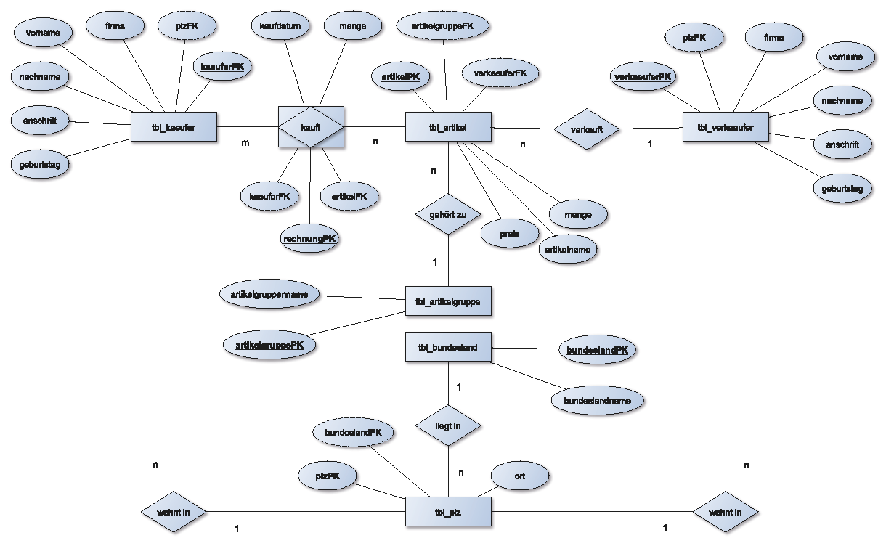

**Schema:**


---

### Informationsmaterial M|5.0: Relationales Datenbank-Schema

#### Relationales Datenbankmodell

Das Relationale Datenbankmodell ist das verbreitetste Datenmodell, welches in der Datenbankentwicklung als Standard genutzt wird. Das Fundament des Datenbankmodells besteht aus vier Elementen: Tabellen, Attributen, Beziehungen und die Grundlagen der relationalen Algebra.

Sie stellt eine mathematische Beschreibung einer Tabelle und ihre Beziehung zu anderen möglichen Tabellen dar. Die Operationen auf diese Relationen werden durch die relationale Algebra bestimmt.

Des Weiteren ist die relationale Algebra auch die Grundlage für die Datenbanksprache SQL.

Auch wenn die mathematische Gewichtung und die Abstraktion der Daten in diesem Modell sehr stark ist, sind relationale Datenbankmodelle vergleichsweise sehr einfach und flexibel zu erstellen.

#### Eigenschaften vom Relationalen Datenbankmodell

Das relationale Datenbankmodell besteht aus drei wichtigen Bausteinen:

- Tabellen
- Attributen
- Beziehungen

Ein Relationales Datenbankmodell ist eine Ansammlung von Tabellen, die miteinander verknüpft sind. Jede Zeile (auch Tupel genannt) in einer Tabelle ist ein Datensatz. Jedes Tupel besteht aus einer großen Reihe von Eigenschaften (Attributen), den Spalten der Tabelle. Ein Relationsschema legt dabei die Anzahl und den (Daten-) Typ der Attribute für eine Tabelle fest.

Des Weiteren können Verknüpfungen (Beziehungen) über sogenannte Primärschlüssel hergestellt werden, um bestimme Attribute, die den gleichen Primärschlüssel oder in einer Detailtabelle als Fremdschlüssel besitzen, abzufragen.

#### Beispiel für ein Relationales Datenbankmodell

Ein gutes Beispiel für ein Relationales Datenbankmodell ist ein Modell, das Beziehungen zwischen den Tabellen Lager und Artikel klar widerspiegelt. Dieses Datenbankmodell basiert auf der Namenskonvention dieses Lernfeldes:

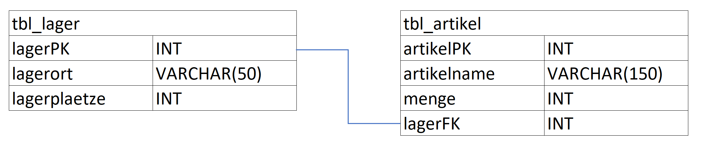

Dieses Beispiel für ein Relationales Datenbankmodell kann nur durch eine korrekte Normalisierung und deren Normalformen erstellt werden. Informationen zu den Datentypen sind in folgenden Materialien verfügbar.

---

### Informationsmaterial M|5.1: Datentypen in MySQL

#### Numerische Datentypen für ganzzahlige Werte

In Feldern dieses Datentyps werden ganzzahlige Werte (Integer-Zahlen) ohne Kommastellen gespeichert.

| Datentyp | Speicherbedarf | Wertebereich |
| :--- | :--- | :--- |
| SMALLINT | 2 Byte | -32768 bis +32767 |
| INTEGER | 4 Byte | -2147483648 bis +2147483647 |

Integer-Datentypen eignen sich besonders für eindeutige Identifikationsnummern, z.B. Primärschlüssel einer Tabelle. Der Zugriff auf solche Datenfelder erfolgt besonders schnell, da Prozessoren in Computern für Zahlenwerte optimiert sind.

#### Numerische Datentypen für Fließkommazahlen

Mit diesen Datentypen können Sie Zahlenwerte mit Nachkommastellen speichern. Die Datentypen unterschieden sich dabei im Wertebereich.

| Datentyp | Speicherbedarf | Wertebereich |
| :--- | :--- | :--- |
| FLOAT (n)	| 4 oder 8 Byte | Die Gesamtstellenanzahl kann durch n festgelegt werden. Je nach Angabe von n können 7 bis 15 signifikante Stellen plattformunabhängig gespeichert werden. |
| DOUBLE PRECISION | 8 Byte | 15 signifikante Stellen (keine plattformunabhängige Speicherung) |

Die Datentypen können einen Zahlenwert mit der angegeben Anzahl an Gleitkommastellen speichern. Alle Ziffern nach der Anzahl signifikanter Stellen werden abgeschnitten, daher wird bei diesen Datentypen nicht immer die genaue Größe gespeichert, sondern die näherungsweise Größe.

#### Numerische Datentypen für Festkommazahlen

Diese Datentypen eignen sich für das Speichern formatierter Zahlen mit einer festen Anzahl von Nachkommastellen. Damit können z.B. Währungsangaben oder Messwerte gespeichert werden.

| Datentyp | Wertebereich |
| :--- | :--- |
| DECIMAL(Präzision, Skalierung) | Der Parameter Präzision (1-15) legt die Gesamtzahl der signifikanten Stellen der Zahl fest. Der Parameter Skalierung (1-15) bestimmt die Anzahl der Nachkommastellen, die kleiner oder gleich der Gesamtzahl der Stellen sein muss. Der DECIMAL-Datentyp definiert die minimale Anzahl der signifikanten Stellen. |

#### Datentypen für Datums- und Zeitwerte

Für Datums- und Zeitwerte gibt es spezielle Datentypen. Abhängig vom Datenbank-Server werden unterschiedliche Wertebereiche zugelassen.

| Datentyp | Wertebereich |
| :--- | :--- |
| DATE | 1000-01-01 bis 9999-12-31 |
| DATETIME | 1000-01-01 00:00:00 bis 9999-12-13 23:59:59 |

Der Type DATE erlaubt die Benutzung eines Datums ohne Zeitangabe. MySQL ruft DATE-Werte im Format ‚YYYY-MM-DD‘ ab und zeigt sie auch so an.

#### Datentypen für Zeichen und Texte

Es gibt verschiedene Datentypen für die Speicherung von Textinformationen. Hierbei existieren verschiedene Datentypen mit variabler und fester Menge.

| Datentyp | Wertebereich |
| :--- | :--- |
| CHAR(Länge) | Dieser Datentyp dient zum Speichern beliebiger Textinformationen. Die maximale Länge wird damit als Parameter angegeben (Länge = 1 bis 255). Unabhängige von der tatsächlichen Länge der gespeicherten Information wird stets die bei der Definition angegebene Anzahl an Zeichen gespeichert. |
| VARCHAR(Länge) | Zum Speichern beliebiger Textinformationen wird auch dieser Typ verwendet. Auch hier wird die maximale Länge (1 bis 255) als Parameter übergeben. In ein Datenfeld dieses Typs eingehender Text wird in seiner tatsächlichen Länge gespeichert. |
| BLOB | Dieser Datentyp (Binary Large Objects) wird zum Speichern großer, auch binärer Datenmengen eingesetzt, z.B. sehr großer Textdateien, Grafiken, Bilder oder Videos. |
| TEXT | Wie auch in BLOB-Feldern können Sie hier größere Informationsmengen mit variabler Länge speichern. Der Unterschied zu BLOB-Feldern liegt in der anderen Sortierreihenfolge, die bei TEXT-Feldern unabhängig von der Groß- und Kleinschreibung ist. |

Die Verarbeitung des Datentyps CHAR erfolgt schneller als auf VARCHAR-Datenfeldern.
VARCHAR-Datenfelder hingegen eignen sich besonders für die Speicherung von unterschiedlich langen Texten.

#### Logischer Datentyp

| Datentyp | Erklärung |
| :--- | :--- |
| BOOLEAN | Logische Werte Ja/Nein bzw. True/False. NULL ist ebenfalls möglich und wird als UNKNOWN interpretiert. |

---

## Kompetenz 5.2: Datenbanken in SQL anlegen

Mit dem relationalen Datenbank-Schema haben Sie eine Basis für die Realisierung der Datenbank geschaffen. Diese Umsetzung in MySQL wird an dieser Stelle begonnen.

---

### Arbeitsauftrag A|5.3: Anlegen der Datenbank in MySQL

Legen Sie nun auf Basis des relationalen Datenbankschemas zur BSE GmbH & Co. KG die Datenbank an. Dazu sollen Sie ein Script schreiben (in Visual Studio Code als .sql-Datei), welches dann in PhpMyAdmin importiert werden kann.

Fügen Sie jeder Tabelle mindestens einen Test-Datensatz hinzu.

---

### Informationsmaterial M|5.2: Befehle in MySQL

#### Datenbanken in MySQL erstellen, löschen, wechseln und anzeigen

Eine Datenbank erstellen:

```sql
CREATE DATABASE [IF NOT EXISTS] db_datenbankname;
```

Eine Datenbank löschen:

```sql
DROP DATABASE [IF EXISTS] db_datenbankname;
```

Die Datenbank wechseln:

```sql
USE db_datenbankname;
```

Alle Datenbanken anzeigen:

```sql
SHOW DATABASES;
```

#### Erstellen von Tabellen

Allgemeine Syntax zum Erstellen von Tabellen:

```sql
CREATE TABLE tbl_tabellenname (
    Datenfeld1 Datentyp1 [default Standardwert1 | NULL | NOT NULL] [AUTO_INCREMENT],
    Datenfeld2 Datentyp2 [default Standardwert2 | NULL | NOT NULL] [AUTO_INCREMENT],
    …
    DatenfeldX DatentypX [default StandardwertX | NULL | NOT NULL] [AUTO_INCREMENT],
    PRIMARY KEY (Datenfeldname),
    FOREIGN KEY (Datenfeldname) REFERENCES Tabelle(Datenfeldname)
);
```

Die eckigen Klammern werden nicht mitgeschrieben, diese sollen nur die optionalen Werte kenntlich machen.

Mit der Anweisung `CREATE TABLE` wird eine neue, leere Tabelle erstellt. Danach folgt der gewünschte Tabellenname.

In runden Klammern folgen die Definitionen der einzelnen Datenfelder. Für jedes Datenfeld müssen dabei ein Name und ein Datentyp (s. Informationsmaterial im Kurs) angegeben werden.

Mit der Angabe `PRIMARY KEY` kann ein Datenfeld als Primärschlüssel festgelegt werden. Beispiel der Syntax: 

```sql
CREATE TABLE tbl_mitarbeiter (
    mitarbeiterPK INT NOT NULL AUTO_INCREMENT,
    vorname VARCHAR(100),
    nachname VARCHAR(100),
    PRIMARY KEY (mitarbeiterPK)
);
```

Erläuterungen zu den Parametern, die bei der Definition der Datenfelder möglich sind

| Parameter | Erläuterung |
| :--- | :--- |
| `NOT NULL` | Mit diesem Parameter wird die Eingabe eines Wertes für das entsprechende Datenfeld erzwungen. Diese Eingabe ist für Schlüsselfelder unbedingt anzugeben. |
| `NULL` | Mit diesem Parameter wird festgelegt, dass das Datenfeld standardmäßig keinen Wert (auch nicht 0 oder die leere Zeichenkette) enthält. (Ausgesprochen: [nʌl] ) |
| `DEFAULT [Standardwert]` | Dieser Parameter definiert einen Standardwert für das Datenfeld. Erhält dieses Datenfeld bei der Eingabe der Daten keinen Wert, wird der Standardwert verwendet. Die eckigen Klammern werden nicht mitgeschrieben, diese sollen nur den variablen Wert kenntlich machen.|
| `AUTO_INCREMENT` | Der Wert dieses Datenfeldes wird automatisch beim Anlegen eines neuen Datensatzes aus dem Wert des Datenfeldes des vorherigen Datensatzes plus eins errechnet. Dieser Wert kann vom Benutzer nicht geändert werden. |

#### Vorhandene Tabellen anzeigen

```sql
SHOW TABLES [FROM Datenbankname];
```

- Die Anweisung `SHOW TABLES` zeigt eine Liste der vorhandenen Tabellen in der aktuell geöffneten Datenbank an.
- Mit Hilfe des Schlüsselwortes `FROM` kann eine andere Datenbank benannt werden.

#### Tabellen löschen

```sql
DROP TABLE Tabellenname;
```

Mit der Anweisung `DROP TABLE` wird die angegebene Tabelle mit allen enthaltenen Daten gelöscht.

#### Daten in Tabellen einfügen

```sql
INSERT INTO Tabellenname (Datenfeld1, Datenfeld2, …, DatenfeldX) VALUES
    (Wert1.1, Wert1.2, …, Wert1.X),
    (Wert2.1, Wert2.2, …, Wert2.X),
    …
    (WertY.1, WertY.2, …, WertY.X);
```

- Textinformationen, Datums- und Zeitwerte sind in Apostrophe (‘…‘) oder Anführungszeichen (“…“) einzuschließen.
- Im nachfolgenden Beispiel wird eine Tabelle Mitarbeiter erstellt und anschließend mit zwei Beispieldatensätzen gefüllt:

```sql
CREATE TABLE tbl_mitarbeiter (
    mitarbeiterPK INT NOT NULL AUTO_INCREMENT,
    vorname VARCHAR(100),
    nachname VARCHAR(100),
    strasse VARCHAR(100),
    plz CHAR(5),
    ort VARCHAR(100),
    gebdat DATE,
    PRIMARY KEY(mitarbeiterPK)
);
```

```sql
INSERT INTO tbl_mitarbeiter (vorname, nachname, strasse, plz, ort, gebdat) VALUES
    ("Rainer", "Zufall", "Dorfweg 6 ", "01689", "Nullerhausen", "1978-01-05"),
    ("Anna", "Log", "Kirchplatz 21", "10850", "Berlin", "1985-06-17");
```

#### Erste Abfrage von Datensätzen

Beispiel:

```sql
SELECT * FROM tbl_mitarbeiter;
```

Ausgabe des Beispiels in phpMyAdmin:

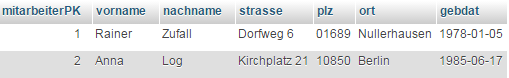

#### Datensätze aktualisieren

```sql
UPDATE Tabellenname SET Datenfeld1 = Wert1, Datenfeld2 = Wert2, …, DatenfeldX = WertX
[WHERE Bedingung];
```

- Mit der Hilfe der `WHERE`-Anweisung kann eine Bedingung eingegeben werden. Die Aktualisierung erfolgt dann nur bei den Datensätzen, die diese Bedingung erfüllen. Wird keine Bedingung angegeben, erfolgt die Wertzuweisung bei allen Datensätzen.

Beispiel der Syntax:

```sql
UPDATE tbl_mitarbeiter SET nachname = "Ernst"
WHERE nachname = "Zufall" AND vorname = "Rainer";
```

#### Daten löschen

```sql
DELETE FROM Tabellenname
[WHERE Bedingung];
```

- Wenn keine `WHERE`-Bedingung angegeben wird, werden ohne Nachfrage alle Datensätze gelöscht. Als Resultat verbleibt eine leere Tabelle!

---

### Arbeitsauftrag A|5.4: Anzeigen der Datenbank über CLI (bspw. für XAMPP-User)

Verschaffen Sie sich einen Überblick zu der Arbeit mit der CLI und den weiteren MySQL-Befehlen.

---

### Informationsmaterial M|5.3: Arbeiten auf dem Datenbankserver über die Konsole

Wie in der Einführung zu Datenbanken beschrieben, ist auch der MySQL-Server (bspw. über XAMPP) mittels verschiedener Anwendungsprogramme erreichbar. In XAMPP ist (wenn mit installiert) phpMyAdmin, wie Sie bereits gesehen haben, eine einfache Möglichkeit, Datenbanken zu verwalten. Aber auch andere Programme ermöglichen die Arbeit in der Datenbank, so z.B. auch Adminer. Alle diese Programme haben etwas gemeinsam: Sie sollen das Arbeiten mit Datenbanken vereinfachen.

Wenn Sie direkt auf dem Datenbankserver arbeiten wollen, können Sie dies aber auch direkt über Command Line Interface (CLI) durchführen. Dazu wählen Sie im XAMPP-Contol-Center die Schaltfläche "Shell" aus.

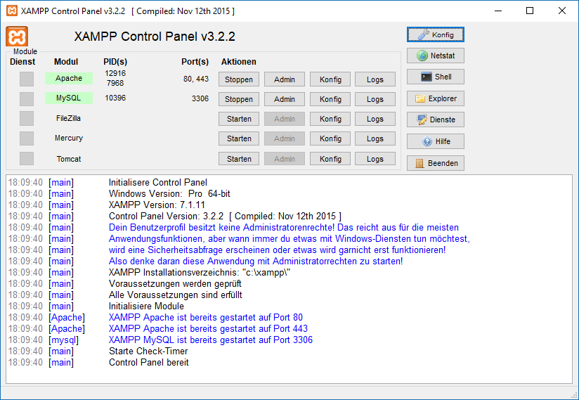

Danach öffnet sich ein weiteres Fenster mit folgenden Inhalt:

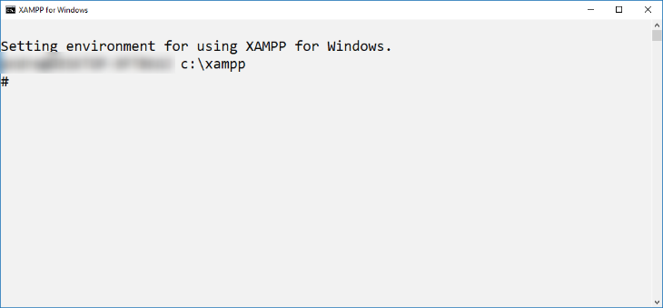

Nun müsen Sie sich mit dem MySQL-Server verbinden. Der Befehl `mysql -u root` dient zur Anmeldung mit dem User "root".

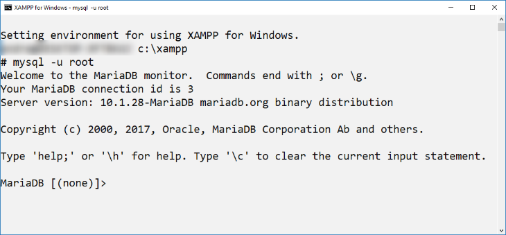

Angemeldet sind Sie nun, jedoch steht "none" im Prompt noch dafür, dass Sie keine Datenbank ausgewählt haben. Das müssen Sie über den Befehl USE datenbankname ändern, um in einer Ihrer Datenbanken zu arbeiten:

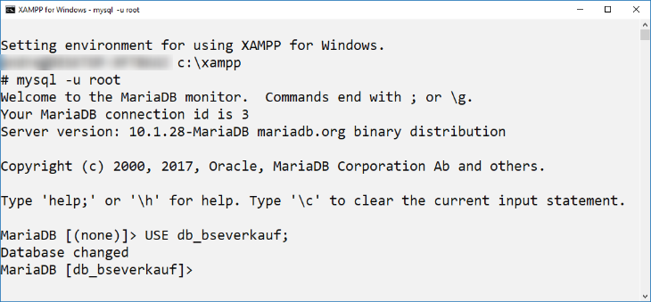

---

### Informationsmaterial M|5.4: Weitere Befehle in MySQL

Wenn Sie über CLI auf dem Server arbeiten, haben Sie keine grafischen Hilfsmittel für die Ansicht der Datenbank. Das bedeutet, dass Sie einige Informationen nur durch manuelle Suche erhalten. Auf der Datenbankebene benutzen Sie den Befehl SHOW um Informationen über Datenbanken, Tabellen, Prozeduren und Funktionen zu erhalten. Um die Tabellenstruktur anzuzeigen benutzen Sie den Befehl `EXPLAIN`.

| Befehl | Aktion |
| :--- | :--- |
| `SHOW DATABASES;` | Listet die verfügbaren Datenbanken auf. |
| `SHOW TABLES;` | Listet die verfügbaren Tabellen auf. |
| `EXPLAIN [tabellenname];` | Ausgabe der Tabellenstruktur mit allen Spalten und Datentypen |

In der BSE Datenbank sieht die Ausgabe der Tabellenanzeige wie folgt aus:

```sql
SHOW TABLES;
```

```
+-------------------------+
| Tables_in_db_bseverkauf |
+-------------------------+
| tbl_artikel             |
| tbl_artikelgruppe       |
| tbl_bundesland          |
| tbl_kaeufer             |
| tbl_plz                 |
| tbl_rechnung            |
| tbl_verkaeufer          |
+-------------------------+
```

Möchte man mehr über die Tabellenstruktur bzw. über die verwendeten Datentypen wissen, hilft der EXPLAIN-Befehl:

```sql
EXPLAIN tbl_plz;
```

```
+--------------+-------------+------+-----+---------+-------+
| Field        | Type        | Null | Key | Default | Extra |
+--------------+-------------+------+-----+---------+-------+
| plzPK        | char(5)     | NO   | PRI | NULL    |       |
| ort          | varchar(60) | YES  |     | NULL    |       |
| bundeslandFK | char(2)     | YES  | MUL | NULL    |       |
+--------------+-------------+------+-----+---------+-------+
```

---

### Arbeitsauftrag A|5.5: Datenbanksprache

In der Datenbanksprache SQL wird zwischen vier Arten von SQL-Kommandos unterschieden. Beschreiben Sie, was mit den folgenden Sprachteilen gemeint ist:

- DML-Kommandos (Data Manipulation Language)
- DDL-Kommandos (Data Definition Language)
- DCL-Kommandos (Data Control Language)
- DQL-Kommandos (Data Query Language)

*Nutzen Sie dafür das Script SQL-Grundlagen aus dem Herdt All-You-Can-Read in Ihrem mm-bbs.de-Landingpage-Portal.*

!!! note "Zusätzliches Material, weitere Übungen & Tipps"

    Die folgenden Übungen und Tipps & Tricks dienen Ihrer persönlichen Wiederholung und Vorbereitung auf Klassenarbeiten, Prüfungen etc.<br><br>*Ich kann, weil ich will, was ich muss! (Immanuel Kant)*

## Übungen

### Übung UE|5.0: Relationales Datenbankschema zur db_universitaet erstellen

Erstellen Sie zum ERM und der Kurzschreibweise (s.u.) das relative Datenbankschema der db_universitaet.

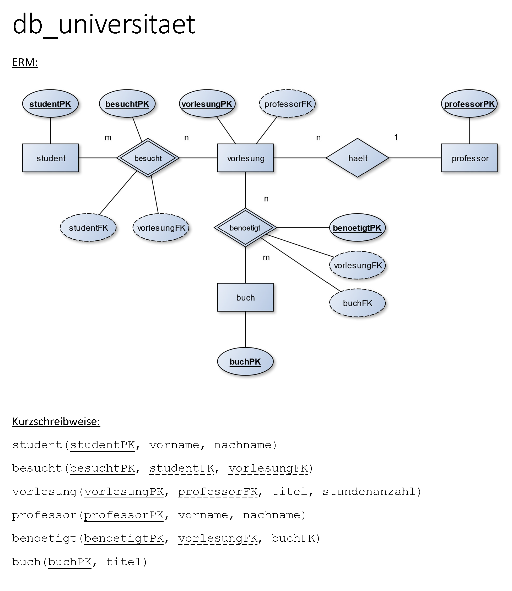

---

### Übung UE|5.1: Anlegen der db_universitaet in MySQL

Erstellen Sie ein in phpMyAdmin importierbares SQL-Script, welches die db_universitaet anlegt und für jede Tabelle zwei Datensätze hinzufügt.

---

### Übung UE|5.2: Importieren des SQL-Scriptes in phpMyAdmin

Öffnen Sie phpMyAdmin (nach dem Start von XAMPP über die Adresse localhost/phpmyadmin). Wählen Sie den Reiter "Importieren" und anschließend Ihr SQL-Script (oder die Lösung s.u.) aus. Letztlich können alle Einstellungen der Import-Oberfläche beibehalten und mit "OK" die Datenbank erstellt werden.

Prüfen Sie nach dem Import, ob Ihre Daten korrekt hochgeladen wurden.

```sql
CREATE DATABASE IF NOT EXISTS db_universitaet;
USE db_universitaet;

CREATE TABLE tbl_student (
	studentPK INT NOT NULL AUTO_INCREMENT,
	vorname VARCHAR(40),
	nachname VARCHAR(40),
	PRIMARY KEY (studentPK)
);

INSERT INTO tbl_student (vorname, nachname) VALUES
	("Rainer", "Zufall"),
	("Robin", "Hutt");

CREATE TABLE tbl_besucht (
	besuchtPK INT NOT NULL AUTO_INCREMENT,
	studentFK INT,
	vorlesungFK INT,
	PRIMARY KEY (besuchtPK)
);

INSERT INTO tbl_besucht (studentFK, vorlesungFK) VALUES
	("1", "1"),
	("2", "1");

CREATE TABLE tbl_vorlesung (
	vorlesungPK INT NOT NULL AUTO_INCREMENT,
	professorFK INT,
	titel VARCHAR(90),
	stundenanzahl INT,
	PRIMARY KEY (vorlesungPK)
);

INSERT INTO tbl_vorlesung (professorFK, titel, stundenanzahl) VALUES
	(1, "Einführung in die Quantenphysik", 4),
	(2, "Philosophie des Immanuel Kant", 2);

CREATE TABLE tbl_professor (
	professorPK INT NOT NULL AUTO_INCREMENT,
	vorname VARCHAR(40),
	nachname VARCHAR(40),
	PRIMARY KEY (professorPK)
);

INSERT INTO tbl_professor (vorname, nachname) VALUES
	("Andy", "Arbeit"),
	("Theo", "Rist");

CREATE TABLE tbl_buch (
	buchPK INT NOT NULL AUTO_INCREMENT,
	titel VARCHAR(90),
	PRIMARY KEY (buchPK)
);

INSERT INTO tbl_buch (titel) VALUES
	("Quantenphysik für Dummies"),
	("Kritik der reinen Vernunft");

CREATE TABLE tbl_benoetigt (
	benoetigtPK INT NOT NULL AUTO_INCREMENT,
	vorlesungFK INT,
	buchFK INT,
	PRIMARY KEY (benoetigtPK)
);

INSERT INTO tbl_benoetigt (vorlesungFK, buchFK) VALUES
	(1, 1),
	(2, 2);
```

---

### Übung UE|5.3: Anlegen von Datenbanken - Fehlersuche

Führen Sie die Fehlersuche der kommenden Aufgaben nach folgendem Schema durch:

1. Importieren Sie unter db-fiddle.com die SQL-Anweisungen.
2. Starten Sie das Einlesen mit "Run".
3. Beschreiben Sie die Art der angezeigten Fehlermeldung.
4. Führen Sie die Korrektur durch.
5. Starten Sie zur Kontrolle das Einlesen mit "Run".

#### Aufgabe 1

```sql
CREATE DATABASE db_ferienhausvermietung;

CREATE TABLE tbl_ferienhaus (
    ferienhausPK CHAR(2) NOT NULL AUTO_INCREMENT,
    zimmername VARCHAR(50),
    anzahl_raeume INT,
    sauna BOOLEAN,
    kaminofen BOOLEAN,
    tagespreis DECIMAL(12,2),
    PRIMARY KEY (ferienhausPK)
);

CREATE TABLE tbl_plz (
    plzPK CHAR(5) NOT NULL,
    ort VARCHAR(100),
    PRIMARY KEY (plzPK)
);

CREATE TABLE tbl_kunde (
    kundePK INT NOT NULL AUTO_INCREMENT,
    vorname VARCHAR(50),
    nachname VARCHAR(50),
    anschrift VARCHAR(255),
    plzFK CHAR(5),
    PRIMARY KEY (kundePK),
    FOREIGN KEY (plzFK) REFERENCES tbl_plz(plzPK)
);

CREATE TABLE tbl_mietet (
    mietetPK INT NOT NULL AUTO_INCREMENT,
    ferienhausFK INT,
    kundeFK INT,
    mietbeginn DATETIME,
    mietende DATETIME,
    PRIMARY KEY (mietetPK),
    FOREIGN KEY (ferienhausFK) REFERENCES tbl_ferienhaus(ferienhausPK),
    FOREIGN KEY (kundeFK) REFERENCES tbl_kunde(kundePK)
);

INSERT INTO tbl_ferienhaus (zimmername, anzahl_raeume, sauna, kaminofen, tagespreis) VALUES
    ("Baltrum", 3, 1, 0, 90.00),
    ("Wangerooge", 5, 1, 1, 92.50),
    ("Langeoog", 2, 0, 0, 80.00),
    ("Spiekerooge", 3, 0, 0, 180.00),
    ("Amrum", 4, 1, 1, 290.00);

INSERT INTO tbl_plz (plzPK, ort) VALUES
    ("99085","Erfurt"),
    ("10119","Berlin"),
    ("97097","Würzburg"),
    ("70180","Stuttgart");

INSERT INTO tbl_kunde (vorname, nachname, anschrift, plzFK) VALUES
    ("Tim","Mälzer","Harlandstr. 2","99085"),
    ("Steffen","Henssler","Wogenweg 76","10119"),
    ("Christian","Rach","Ellenweg 9","97097"),
    ("Frank","Rosin","Meinardusallee 22","97097"),
    ("Johann","Lafer","Feierstr. 65","70180");

INSERT INTO tbl_mietet (ferienhausFK, kundeFK, mietbeginn, mietende) VALUES
    (1,5,"2021-04-21","2021-04-30"),
    (2,4,"2021-05-03","2021-05-17"),
    (3,3,"2021-04-15","2021-04-22"),
    (4,2,"2021-06-03","2021-06-20"),
    (5,1,"2021-04-29","2021-05-15");
```

#### Aufgabe 2

```sql
CREATE DATABASE db_ferienhausvermietung;

CREATE TABLE tbl_ferienhaus (
    ferienhausPK INT NOT NULL AUTO_INCREMENT,
    zimmername VARCHAR(50),
    anzahl_raeume INT,
    sauna BOOLEAN,
    kaminofen BOOLEAN,
    tagespreis DECIMAL(12,2),
    PRIMARY KEY (ferienhausPK)
);

CREATE TABLE tbl_plz (
    plzPK CHAR(5) NOT NULL,
    ort VARCHAR(100),
    PRIMARY KEY (plzPK)
);

CREATE TABLE tbl_kunde (
    kundePK INT NOT NULL AUTO_INCREMENT,
    vorname VARCHAR(50),
    nachname VARCHAR(50),
    anschrift VARCHAR(255),
    plzFK CHAR(5),
    PRIMARY KEY (kundePK),
    FOREIGN KEY (plzFK) REFERENCES tbl_plz(plsPK)
);

CREATE TABLE tbl_mietet (
    mietetPK INT NOT NULL AUTO_INCREMENT,
    ferienhausFK INT,
    kundeFK INT,
    mietbeginn DATETIME,
    mietende DATETIME,
    PRIMARY KEY (mietetPK),
    FOREIGN KEY (ferienhausFK) REFERENCES tbl_ferienhaus(ferienhausPK),
    FOREIGN KEY (kundeFK) REFERENCES tbl_kunde(kundePK)
);

INSERT INTO tbl_ferienhaus (zimmername, anzahl_raeume, sauna, kaminofen, tagespreis) VALUES
    ("Baltrum", 3, 1, 0, 90.00),
    ("Wangerooge", 5, 1, 1, 92.50),
    ("Langeoog", 2, 0, 0, 80.00),
    ("Spiekerooge", 3, 0, 0, 180.00),
    ("Amrum", 4, 1, 1, 290.00);

INSERT INTO tbl_plz (plzPK, ort) VALUES
    ("99085","Erfurt"),
    ("10119","Berlin"),
    ("97097","Würzburg"),
    ("70180","Stuttgart");

INSERT INTO tbl_kunde (vorname, nachname, anschrift, plzFK) VALUES
    ("Tim","Mälzer","Harlandstr. 2","99085"),
    ("Steffen","Henssler","Wogenweg 76","10119"),
    ("Christian","Rach","Ellenweg 9","97097"),
    ("Frank","Rosin","Meinardusallee 22","97097"),
    ("Johann","Lafer","Feierstr. 65","70180");

INSERT INTO tbl_mietet (ferienhausFK, kundeFK, mietbeginn, mietende) VALUES
    (1,5,"2021-04-21","2021-04-30"),
    (2,4,"2021-05-03","2021-05-17"),
    (3,3,"2021-04-15","2021-04-22"),
    (4,2,"2021-06-03","2021-06-20"),
    (5,1,"2021-04-29","2021-05-15");
```

#### Aufgabe 3

```sql
CREATE DATABASE db_ferienhausvermietung;

CREATE TABLE tbl_ferienhaus (
    ferienhausPK INT NOT NULL AUTO_INCREMENT,
    zimmername VARCHAR(50),
    anzahl_raeume INT,
    sauna BOOLEAN,
    kaminofen BOOLEAN,
    tagespreis DECIMAL(12,2),
    PRIMARY KEY (ferienhausPK)
);

CREATE TABLE tbl_plz (
    plzPK CHAR(5) NOT NULL,
    ort VARCHAR(100),
    PRIMARY KEY (plzPK)
);

CREATE TABLE tbl_kunde (
    kundePK INT NOT NULL AUTO_INCREMENT,
    vorname VARCHAR(50),
    nachname VARCHAR(50),
    anschrift VARCHAR(255),
    plzFK CHAR(5),
    PRIMARY KEY (kundePK),
    FOREIGN KEY (plzFK) REFERENCES tbl_plz(plzPK)
);

CREATE TABLE tbl_mietet (
    mietetPK INT NOT NULL AUTO_INCREMENT,
    ferienhausFK INT,
    kundeFK INT,
    mietbeginn DATETIME,
    mietende DATETIME,
    PRIMARY KEY (mietetPK),
    FOREIGN KEY (ferienhausFK) REFERENCES tbl_ferienhaus(ferienhausPK),
    FOREIGN KEY (kundeFK) REFERENCES tbl_kunde(kundePK)
);

INSERT INTO tbl_ferienhaus (zimmername, anzahl_raeume, sauna, kaminofen, tagespreis) VALUES
    ("Baltrum", 3, 1, 0, 90.00),
    ("Wangerooge", 5, 1, 1, 92.50),
    ("Langeoog", 2, 0, 0, 80.00),
    ("Spiekerooge", 3, 0, 0, 180.00),
    ("Amrum", 4, 1, 1, 290.00);

INSERT INTO tbl_plz (plzPK, ort) VALUES
    ("99085","Erfurt"),
    ("10119","Berlin"),
    ("97097","Würzburg"),
    ("70180","Stuttgart");

INSERT INTO tbl_kunde (vorname, nachname, anschrift, plzFK) VALUES
    ("Tim","Mälzer","Harlandstr. 2","99085"),
    ("Steffen","Henssler","Wogenweg 76","10119"),
    ("Christian","Rach","Ellenweg 9","97097"),
    ("Frank","Rosin","Meinardusallee 22","97097"),
    ("Johann","Lafer","Feierstr. 65","70180");

INSERT INTO tbl_mietet (ferienhausFK, kundeFK, mietbeginn, mietende) VALUES
    (1,5,"2021-04-21","2021-04-30"),
    (2,4,"2021-05-03","2021-05-17"),
    (3,3,"2021-04-15","2021-04-22"),
    (4,2,"2021-06-03","2021-06-20"),
    (6,1,"2021-04-29","2021-05-15");
```

#### Aufgabe 4

```sql
CREATE DATABASE db_ferienhausvermietung;

CREATE TABLE tbl_ferienhaus (
    ferienhausPK INT NOT NULL AUTO_INCREMENT,
    zimmername VARCHAR(50),
    anzahl_raeume INT,
    sauna BOOLEAN,
    kaminofen BOOLEAN,
    tagespreis DECIMAL(12,2),
    PRIMARY KEY (ferienhausPK)
);

CREATE TABLE tbl_plz (
    plzPK CHAR(5) NOT NULL,
    ort VARCHAR(100),
    PRIMARY KEY (plzPK)
);

CREATE TABLE tbl_kunde (
    kundePK INT NOT NULL AUTO_INCREMENT,
    vorname VARCHAR(50),
    nachname VARCHAR(50),
    anschrift VARCHAR(255),
    plzFK CHAR(5),
    PRIMARY KEY (kundePK),
    FOREIGN KEY (plzFK) REFERENCES tbl_plz(plzPK)
);

CREATE TABLE tbl_mietet (
    mietetPK INT NOT NULL AUTO_INCREMENT,
    ferienhausFK INT,
    kundeFK INT,
    mietbeginn DATETIME,
    mietende DATETIME,
    PRIMARY KEY (mietetPK),
    FOREIGN KEY (ferienhausFK) REFERENCES tbl_ferienhaus(ferienhausPK),
    FOREIGN KEY (kundeFK) REFERENCES tbl_kunde(kundePK)
);

INSERT INTO tbl_ferienhaus (zimmername, anzahl_raeume, sauna, tagespreis) VALUES
    ("Baltrum", 3, 1, 0, 90.00),
    ("Wangerooge", 5, 1, 1, 92.50),
    ("Langeoog", 2, 0, 0, 80.00),
    ("Spiekerooge", 3, 0, 0, 180.00),
    ("Amrum", 4, 1, 1, 290.00);

INSERT INTO tbl_plz (plzPK, ort) VALUES
    ("99085","Erfurt"),
    ("10119","Berlin"),
    ("97097","Würzburg"),
    ("70180","Stuttgart");

INSERT INTO tbl_kunde (vorname, nachname, anschrift, plzFK) VALUES
    ("Tim","Mälzer","Harlandstr. 2","99085"),
    ("Steffen","Henssler","Wogenweg 76","10119"),
    ("Christian","Rach","Ellenweg 9","97097"),
    ("Frank","Rosin","Meinardusallee 22","97097"),
    ("Johann","Lafer","Feierstr. 65","70180");

INSERT INTO tbl_mietet (ferienhausFK, kundeFK, mietbeginn, mietende) VALUES
    (1,5,"2021-04-21","2021-04-30"),
    (2,4,"2021-05-03","2021-05-17"),
    (3,3,"2021-04-15","2021-04-22"),
    (4,2,"2021-06-03","2021-06-20"),
    (5,1,"2021-04-29","2021-05-15");
```

#### Aufgabe 5

```sql
CREATE DATABASE db_ferienhausvermietung;

CREATE TABLE tbl_ferienhaus (
    ferienhausPK INT NOT NULL AUTO_INCREMENT,
    zimmername VARCHAR(50),
    anzahl_raeume INT,
    sauna BOOLEAN,
    kaminofen BOOLEAN,
    tagespreis DECIMAL(12,2),
    PRIMARY KEY (ferienhausPK)
);

CREATE TABLE tbl_plz (
    plzPK CHAR(5) NOT NULL,
    ort VARCHAR(100),
    PRIMARY KEY (plzPK)
);

CREATE TABLE tbl_kunde (
    kundePK INT NOT NULL AUTO_INCREMENT,
    vorname VARCHAR(50),
    nachname VARCHAR(50),
    anschrift VARCHAR(255),
    plzFK CHAR(5),
    PRIMARY KEY (kundePK),
    FOREIGN KEY (plzFK) REFERENCES tbl_plz(plzPK)
);

CREATE TABLE tbl_mietet (
    mietetPK INT NOT NULL AUTO_INCREMENT,
    ferienhausFK INT,
    kundeFK INT,
    mietbeginn DATETIME,
    mietende DATETIME,
    PRIMARY KEY (mietetPK),
    FOREIGN KEY (ferienhausFK) REFERENCES tbl_ferienhaus(ferienhausPK),
    FOREIGN KEY (kundeFK) REFERENCES tbl_kunde(kundePK)
);

INSERT INTO tbl_ferienhaus (zimmername, anzahl_raeume, sauna, kaminofen, tagespreis) VALUES
    ("Baltrum", 3, 1, 0, 90.00),
    ("Wangerooge", 5, 1, 1, 92.50),
    ("Langeoog", 2, 0, 0, 80.00),
    ("Spiekerooge", 3, 0, 0, 180.00),
    ("Amrum", 4, 1, 1, 290.00);

INSERT INTO tbl_kunde (vorname, nachname, anschrift, plzFK) VALUES
    ("Tim","Mälzer","Harlandstr. 2","99085"),
    ("Steffen","Henssler","Wogenweg 76","10119"),
    ("Christian","Rach","Ellenweg 9","97097"),
    ("Frank","Rosin","Meinardusallee 22","97097"),
    ("Johann","Lafer","Feierstr. 65","70180");

INSERT INTO tbl_mietet (ferienhausFK, kundeFK, mietbeginn, mietende) VALUES
    (1,5,"2021-04-21","2021-04-30"),
    (2,4,"2021-05-03","2021-05-17"),
    (3,3,"2021-04-15","2021-04-22"),
    (4,2,"2021-06-03","2021-06-20"),
    (5,1,"2021-04-29","2021-05-15");

INSERT INTO tbl_plz (plzPK, ort) VALUES
    ("99085","Erfurt"),
    ("10119","Berlin"),
    ("97097","Würzburg"),
    ("70180","Stuttgart");
```

#### Aufgabe 6

```sql
CREATE DATABASE db_ferienhausvermietung;

CREATE TABLE tbl_ferienhaus (
    ferienhausPK INT NOT NULL AUTO_INCREMENT,
    zimmername VARCHAR(50),
    anzahl_raeume INT,
    sauna BOOLEAN,
    kaminofen BOOLEAN,
    tagespreis DECIMAL(12,2),
    PRIMARY KEY (ferienhausPK)
);

CREATE TABLE tbl_plz (
    plzPK CHAR(5) NOT NULL,
    ort VARCHAR(100),
    PRIMARY KEY (plzPK)
);

CREATE TABLE tbl_kunde (
    kundePK INT NOT NULL AUTO_INCREMENT,
    vorname VARCHAR(50),
    nachname VARCHAR(50),
    anschrift VARCHAR(255),
    plzFK CHAR(5),
    PRIMARY KEY (kundePK),
    FOREIGN KEY (plzFK) REFERENCES tbl_plz(plzPK)
);

CREATE TABLE tbl_mietet (
    mietetPK INT NOT NULL AUTO_INCREMENT,
    ferienhausFK INT,
    kundeFK INT,
    mietbeginn DATETIME,
    mietende INT,
    PRIMARY KEY (mietetPK),
    FOREIGN KEY (ferienhausFK) REFERENCES tbl_ferienhaus(ferienhausPK),
    FOREIGN KEY (kundeFK) REFERENCES tbl_kunde(kundePK)
);

INSERT INTO tbl_ferienhaus (zimmername, anzahl_raeume, sauna, kaminofen, tagespreis) VALUES
    ("Baltrum", 3, 1, 0, 90.00),
    ("Wangerooge", 5, 1, 1, 92.50),
    ("Langeoog", 2, 0, 0, 80.00),
    ("Spiekerooge", 3, 0, 0, 180.00),
    ("Amrum", 4, 1, 1, 290.00);

INSERT INTO tbl_plz (plzPK, ort) VALUES
    ("99085","Erfurt"),
    ("10119","Berlin"),
    ("97097","Würzburg"),
    ("70180","Stuttgart");

INSERT INTO tbl_kunde (vorname, nachname, anschrift, plzFK) VALUES
    ("Tim","Mälzer","Harlandstr. 2","99085"),
    ("Steffen","Henssler","Wogenweg 76","10119"),
    ("Christian","Rach","Ellenweg 9","97097"),
    ("Frank","Rosin","Meinardusallee 22","97097"),
    ("Johann","Lafer","Feierstr. 65","70180");

INSERT INTO tbl_mietet (ferienhausFK, kundeFK, mietbeginn, mietende) VALUES
    (1,5,"2021-04-21","2021-04-30"),
    (2,4,"2021-05-03","2021-05-17"),
    (3,3,"2021-04-15","2021-04-22"),
    (4,2,"2021-06-03","2021-06-20"),
    (5,1,"2021-04-29","2021-05-15");
```

#### Aufgabe 7

```sql
CREATE DATABASE db_ferienhausvermietung;

CREATE TABLE tbl_ferienhaus (
    ferienhausPK INT NOT NULL AUTO_INCREMENT,
    zimmername VARCHAR(50),
    anzahl_raeume INT,
    sauna BOOLEAN,
    kaminofen BOOLEAN,
    tagespreis DECIMAL(12,2),
    PRIMARY KEY (ferienhausPK)
);

CREATE TABLE tbl_plz (
    plzPK CHAR(5) NOT NULL,
    ort VARCHAR(100),
    PRIMARY KEY (plzPK)
);

CREATE TABLE tbl_kunde (
    kundePK INT NOT NULL AUTO_INCREMENT,
    vorname VARCHAR(50),
    nachname VARCHAR(50),
    anschrift VARCHAR(255),
    plzFK CHAR(5),
    PRIMARY KEY (kundePK),
    FOREIGN KEY (plzFK) REFERENCES tbl_plz(plzPK)
);

CREATE TABLE tbl_mietet (
    mietetPK INT NOT NULL AUTO_INCREMENT,
    ferienhausFK INT,
    kundeFK INT,
    mietbeginn DATETIME,
    mietende DATETIME,
    PRIMARY KEY (mietetPK),
    FOREIGN KEY (ferienhausFK) REFERENCES tbl_ferienhaus(ferienhausPK),
    FOREIGN KEY (kundeFK) REFERENCES tbl_kunde(kundePK)
);

INSERT INTO tbl_ferienhaus (zimmername, anzahl_raeume, sauna, kaminofen, tagespreis) VALUES
    ("Baltrum", 3, 1, 0, 90.00),
    ("Wangerooge", 5, 1, 1, 92.50),
    ("Langeoog", 2, 0, 0, 80.00),
    ("Spiekerooge", 3, 0, 0, 180.00),
    ("Amrum", 4, 1, 1, 290.00);

INSERT INTO tbl_plz (plzPK, ort) VALUES
    ("99085","Erfurt"),
    ("10119","Berlin"),
    ("97097","Würzburg"),
    ("70180","Stuttgart");

INSERT INTO tbl_kunde (vorname, nachname, anschrift, plzFK) VALUES
    ("Tim","Mälzer","Harlandstr. 2","99085"),
    ("Steffen","Henssler","Wogenweg 76","10118"),
    ("Christian","Rach","Ellenweg 9","97097"),
    ("Frank","Rosin","Meinardusallee 22","97097"),
    ("Johann","Lafer","Feierstr. 65","70180");

INSERT INTO tbl_mietet (ferienhausFK, kundeFK, mietbeginn, mietende) VALUES
    (1,5,"2021-04-21","2021-04-30"),
    (2,4,"2021-05-03","2021-05-17"),
    (3,3,"2021-04-15","2021-04-22"),
    (4,2,"2021-06-03","2021-06-20"),
    (5,1,"2021-04-29","2021-05-15");
```

#### Aufgabe 8

```sql
CREATE DATABASE db_ferienhausvermietung;

CREATE TABLE tbl_ferienhaus (
    ferienhausPK INT NOT NULL AUTO_INCREMENT,
    zimmername VARCHAR(50),
    anzahl_raeume INT,
    sauna BOOLEAN,
    kaminofen BOOLEAN,
    tagespreis DECIMAL(12,2),
    PRIMARY KEY (ferienhausPK)
);

CREATE TABLE tbl_plz (
    plzPK CHAR(5) NOT NULL,
    ort VARCHAR(100),
    PRIMARY KEY (plzPK)
);

CREATE TABLE tbl_kunde (
    kundePK INT NOT NULL AUTO_INCREMENT,
    vorname VARCHAR(50),
    nachname VARCHAR(50),
    anschrift VARCHAR(255),
    plzFK CHAR(5),
    PRIMARY KEY (kundePK),
    FOREIGN KEY (plzFK) REFERENCES tbl_plz(plzPK)
);

CREATE TABLE tbl_mietet (
    mietetPK INT NOT NULL AUTO_INCREMENT,
    ferienhausFK INT,
    kundeFK INT,
    mietbeginn DATETIME,
    mietende DATETIME,
    PRIMARY KEY (mietetPK),
    FOREIGN KEY (ferienhausFK) REFERENCES tbl_ferienhaus(ferienhausPK),
    FOREIGN KEY (kundeFK) REFERENCES tbl_kunde(kundePK)
);

INSERT INTO tbl_ferienhaus (zimmername, anzahl_raeume, sauna, kaminofen, tagespreis) VALUES
    ("Baltrum", 3, 1, 0, 90.00),
    ("Wangerooge", 5, 1, 1, 92.50),
    ("Langeoog", 2, 0, 0, 80.00),
    ("Spiekerooge", 3, 0, 0, 180.00),
    ("Amrum", 4, 1, 1, 290.00);

INSERT INTO tbl_plz (plzPK, ort) VALUES
    ("99085","Erfurt"),
    ("10119","Berlin"),
    ("97097","Würzburg"),
    ("70180","Stuttgart");

INSERT INTO tbl_kunde (vorname, nachname, anschrift, plzFK) VALUES
    ("Tim","Mälzer","Harlandstr. 2","99085"),
    ("Steffen","Henssler","Wogenweg 76","10119"),
    ("Christian","Rach","Ellenweg 9","97097"),
    ("Frank","Rosin","Meinardusallee 22","97097"),
    ("Johann","Lafer","Feierstr. 65","70180");

INSERT INTO tbl_mietet (ferienhausFK, kundeFK, mietbeginn, mietende, plzPK) VALUES
    (1,5,"2021-04-21","2021-04-30"),
    (2,4,"2021-05-03","2021-05-17"),
    (3,3,"2021-04-15","2021-04-22"),
    (4,2,"2021-06-03","2021-06-20"),
    (5,1,"2021-04-29","2021-05-15");
```

