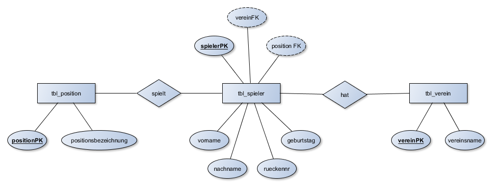

## Kapitel 6: MySQL - Einfache Datenabfragen mit SELECT


In diesem Kapitel ...

- ... führen Sie erste Abfragen mit der Datenbanksprache MySQL durch.

---

!!! example "Webversionen der Datenbanken"
    
    Über die Links stehen Ihnen die Datenbanken zur Verfügung:

    - [db_bseverkauf](https://www.db-fiddle.com/f/mkHxub9CaFDyGgjvvoWMQk/0)
    - [db_universitaet](https://www.db-fiddle.com/f/ghBtL5urMFG87RtkrF7MJR/0)

## Kompetenz 6.0: Einfache Datenbankabfragen mit SELECT durchführen

Die Mitarbeiter der BSE GmbH & Co. KG haben des Öfteren Fragen an Matthias Thale, die er mithilfe seiner bisher eingesetzten Tabellenkalkulation klären konnte. Jetzt nachdem die Datenbank eingerichtet wurde und die ersten Datensätze einer vergangenen Abrechnungsperiode zum Testen erfasst sind, kann die Datenbank getestet werden.

Thilo Ostiem hat eine Liste an Fragen erhalten, die Kolleginnen und Kollegen in der Vergangenheit hinsichtlich der Verkaufsplattform hatten. Nun soll er beweisen, dass die Datenbank schnell die gewünschten Informationen liefern kann. So will z.B. der Datenschutzbeauftragte wissen, welche Attribute für die Käufer gespeichert werden.

---

### Arbeitsauftrag A|6.0: Einfache Datenabfragen mit SELECT

1. Lassen Sie sich alle Käufer mit allen Attributen anzeigen.
2. Welche Bundeslandabkürzungen gibt es und was bedeuten diese?
3. Lassen Sie sich eine Liste aller in der Datenbank befindlichen Postleitzahlen (aus der Postleitzahlen-Tabelle) mit deren Orten anzeigen. Die Zuordnung der Bundesländer soll dabei nicht ausgegeben werden.
4. Lassen Sie sich alle Verkäufer mit dem Nachnamen "Becker" anzeigen.

---

### Informationsmaterial M|6.0: SELECT

#### Grundlagen zu einfachen Datenabfragen (mit SELECT)

Für gezielte Abfragen der gespeicherten Daten in einer Datenbank wird in SQL die `SELECT`-Anweisung verwendet. Sie ist die komplexeste SQL-Anweisung, besitzt viele optionale Erweiterungen und wird in der Praxis am häufigsten genutzt.

Die `SELECT`-Anweisung ähnelt einer Frage bzw. Aufforderung an das Datenbanksystem, die gewünschten Daten zu liefern.

#### Beispiel - Datenbank zur Fußball-Bundesliga

In der Datenbank db_bundesliga sind die Tabellen *tbl_spieler*, *tbl_verein* und *tbl_position* angelegt. Der Aufbau sieht im ERM wie folgt aus:



Die Tabelle *tbl_spieler* enthält dabei folgende Daten:

```
+-----------+--------------+-----------+----------+------------+-----------+------------+
| spielerPK | nachname     | vorname   | vereinFK | positionFK | rueckennr | geburtstag |
+-----------+--------------+-----------+----------+------------+-----------+------------+
|         1 | Weidenfeller | Roman     |        1 |          1 |         1 | 1980-08-06 |
|         2 | Martinez     | Javier    |        2 |          2 |         8 | 1988-09-02 |
|         3 | Fritz        | Clemens   |        3 |          2 |         8 | 1980-12-07 |
|         4 | Meyer        | Max       |        4 |          3 |        10 | 1995-09-18 |
|         5 | Sulejmani    | Valmir    |        5 |          4 |        38 | 1996-02-01 |
|         6 | Schulz       | Christian |        5 |          2 |        19 | 1983-04-01 |
|         7 | Reus         | Marco     |        1 |          3 |        11 | 1989-05-31 |
|         8 | Schmelzer    | Marcel    |        1 |          2 |        29 | 1988-01-22 |
+-----------+--------------+-----------+----------+------------+-----------+------------+
```

#### Aufbau der SQL-Abfrage

Jede SQL-Abfrage hat drei Hauptbefehle:

```
SELECT	(engl. auswählen)
FROM	(engl. von)
WHERE	(engl. wo)
```

Mit `FROM` wird die Tabelle ausgewählt, aus der die gewünschten Informationen stammen. Mit `SELECT` wird angegeben, welche Attribute (Spalten) hieraus in der Ergebnistabelle ausgegeben werden sollen. Zuletzt wird die optionale `WHERE`-Bedingung angegeben. Hierin können bestimmte Datensätze (Zeilen) ausgewählt werden. `WHERE` kann aus einer `SELECT`-Anweisung weggelassen werden, wenn alle Datensätze ausgegeben werden sollen.

#### Fortsetzung des Beispiels - Datenbank zur Fußball-Bundesliga

Wir wollen wissen, welche Spieler die Rückennummer 8 haben. Also hieße die SQL-Abfrage:

```sql
SELECT nachname, vorname, ruckennr	Welche Attribute (Spalten)?
FROM tbl_spieler	Aus welcher Tabelle?
WHERE rueckennr = 8;	Welche Datensätze (Zeilen)?
```
Ergebnis der SQL-Abfrage:

```
+----------+---------+-----------+
| nachname | vorname | rueckennr |
+----------+---------+-----------+
| Martinez | Javier  |         8 |
| Fritz    | Clemens |         8 |
+----------+---------+-----------+
```

#### Hinweise und weitere Informationen

- Wenn man alle Spalten einer Tabelle angezeigt haben möchte, kann man auch einfach ein `*` im `SELECT`-Teil einsetzen.
- Zeichenketten (Strings) wie zum Beispiel `'Schulz'` oder ein Datum `'1989-05-31'` setzt man in einfache Anführungszeichen.
- Es können Bedingungen so formuliert werden, dass keine Datensätze zurückgeliefert werden. Dann ist das Ergebnis eine leere Menge. So würde die im Beispiel genannte Suche mit der `WHERE`-Bedingung `vorname = 'Walter'` eine leere Tabelle ausgeben.
- Bei den Tabellennamen muss die Groß-/Kleinschreibung beachtet werden.
- Zur besseren Übersicht sollten die MySQL-Befehle immer in `GROSSBUCHSTABEN` geschrieben werden.
- Die Ergebnismenge kann z.B. mit `LIMIT 10` auf 10 Zeilen begrenzt werden.

!!! note "Zusätzliches Material, weitere Übungen & Tipps"

    Die folgenden Übungen und Tipps & Tricks dienen Ihrer persönlichen Wiederholung und Vorbereitung auf Klassenarbeiten, Prüfungen etc.<br><br>*Ich kann, weil ich will, was ich muss! (Immanuel Kant)*

## Übungen

### Übung UE|6.0: Vorbereitungen für die Übungen dieses Kapitels

Importieren Sie die db_universitaet neu aus der SQL-Datei (s.u.):

```sql
DROP DATABASE IF EXISTS db_universitaet;
CREATE DATABASE IF NOT EXISTS db_universitaet;
USE db_universitaet;

CREATE TABLE tbl_student (
	studentPK INT NOT NULL AUTO_INCREMENT,
	vorname VARCHAR(40),
	nachname VARCHAR(40),
	PRIMARY KEY (studentPK)
);

CREATE TABLE tbl_buch (
	buchPK INT NOT NULL AUTO_INCREMENT,
	titel VARCHAR(90),
	PRIMARY KEY (buchPK)
);

CREATE TABLE tbl_professor (
	professorPK INT NOT NULL AUTO_INCREMENT,
	vorname VARCHAR(40),
	nachname VARCHAR(40),
	PRIMARY KEY (professorPK)
);

CREATE TABLE tbl_vorlesung (
	vorlesungPK INT NOT NULL AUTO_INCREMENT,
	professorFK INT,
	titel VARCHAR(90),
	stundenanzahl INT,
	PRIMARY KEY (vorlesungPK),
	FOREIGN KEY (professorFK) REFERENCES tbl_professor (professorPK)
);

CREATE TABLE tbl_besucht (
	besuchtPK INT NOT NULL AUTO_INCREMENT,
	studentFK INT,
	vorlesungFK INT,
	PRIMARY KEY (besuchtPK),
	FOREIGN KEY (studentFK) REFERENCES tbl_student (studentPK),
	FOREIGN KEY (vorlesungFK) REFERENCES tbl_vorlesung (vorlesungPK)
);

CREATE TABLE tbl_benoetigt (
	benoetigtPK INT NOT NULL AUTO_INCREMENT,
	vorlesungFK INT,
	buchFK INT,
	PRIMARY KEY (benoetigtPK),
	FOREIGN KEY (vorlesungFK) REFERENCES tbl_vorlesung (vorlesungPK),
	FOREIGN KEY (buchFK) REFERENCES tbl_buch (buchPK)
);

INSERT INTO tbl_student (vorname, nachname) VALUES
	("Rainer", "Zufall"),
	("Robin", "Hutt");

INSERT INTO tbl_buch (titel) VALUES
	("Quantenphysik für Dummies"),
	("Kritik der reinen Vernunft");
	
INSERT INTO tbl_professor (vorname, nachname) VALUES
	("Andy", "Arbeit"),
	("Theo", "Rist");

INSERT INTO tbl_vorlesung (professorFK, titel, stundenanzahl) VALUES
	(1, "Einführung in die Quantenphysik", 4),
	(2, "Philosophie des Immanuel Kant", 2);
	
INSERT INTO tbl_benoetigt (vorlesungFK, buchFK) VALUES
	(1, 1),
	(2, 2);
	
INSERT INTO tbl_besucht (studentFK, vorlesungFK) VALUES
	(1, 1),
	(2, 1);
```

---

### Übung UE|6.1: Abfragen zur db_universitaet

Welche Abfragen sind notwendig?

1. Lassen Sie sich alle Professoren mit allen Attributen anzeigen.
2. Es wird für einen Serienbrief eine Liste der Vor- und Nachnamen aller Studenten benötigt.
3. Welche Vorlesungen werden angeboten?
4. Ein Student möchte Wissen, welche Buchtitel er für das Studium bestellen muss. Lassen Sie sich eine Liste aller Buchtitel ausgeben.
5. Zur Kontrolle der Datenbank soll die Tabelle tbl_benoetigt analysiert werden. Lassen Sie sich alle Attribute anzeigen. Beschreiben Sie die Funktion und Bedeutung der tbl_benoetigt im Rahmen der db_universitaet.

